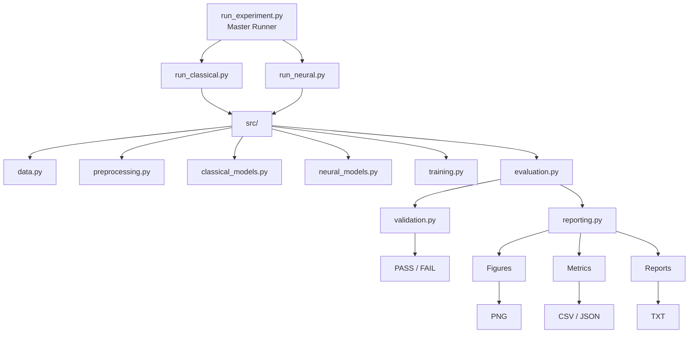
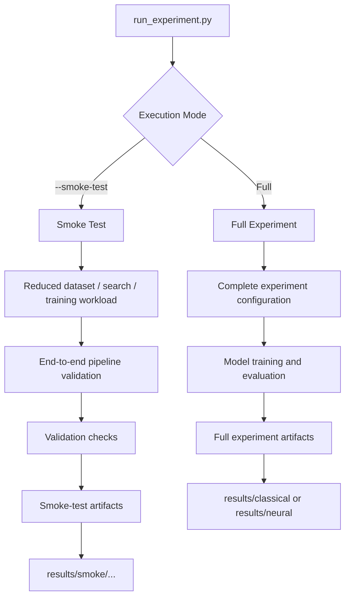
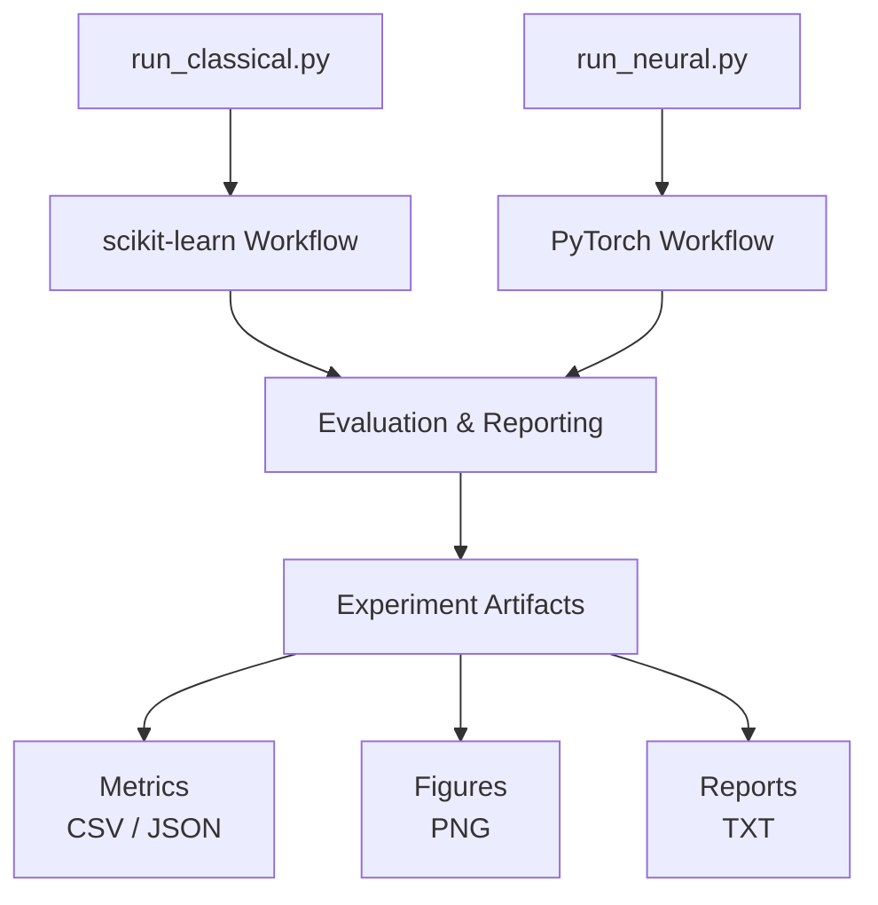
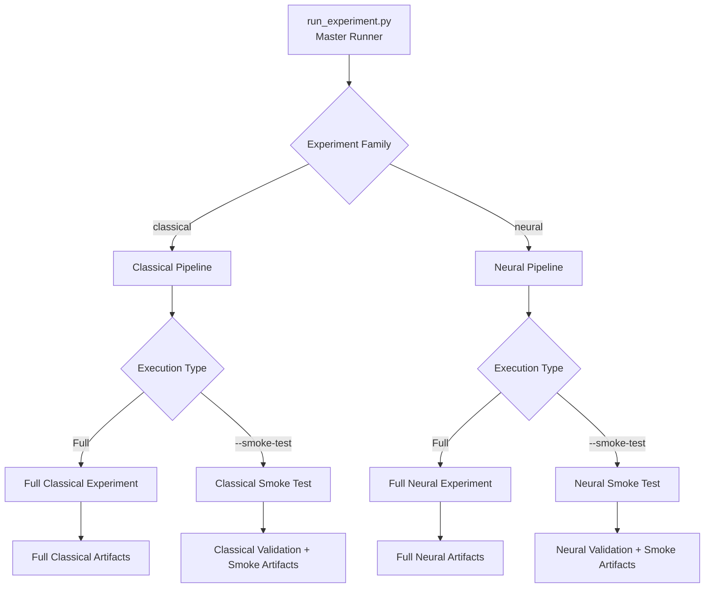

# IMDb Sentiment Classification

Comparative sentiment classification on the Stanford IMDb movie-review dataset using classical machine-learning and neural-network models, implemented as a modular and reproducible Python experimentation framework.

> **Project focus:** this repository develops an academic NLP experiment into a structured ML project for comparing classical and neural sentiment-classification approaches. It separates data preparation, modeling, training, evaluation, validation, and reporting while preserving the experimental analysis and learning behind the original notebook.

---

## Table of Contents

- [Overview](#overview)
- [Project Scope](#project-scope)
- [What This Project Demonstrates](#what-this-project-demonstrates)
- [Quick Start](#quick-start)
- [Dataset](#dataset)
- [End-to-End Architecture](#end-to-end-architecture)
- [Modeling Strategy](#modeling-strategy)
- [Repository Structure](#repository-structure)
- [Design and Modularization](#design-and-modularization)
- [Experiment Execution](#experiment-execution)
- [Validation Strategy](#validation-strategy)
- [Generated Artifacts](#generated-artifacts)
- [Results and Key Observations](#results-and-key-observations)
- [Running the Project](#running-the-project)
- [Engineering Decisions and Learnings](#engineering-decisions-and-learnings)
- [Detailed Experiment Analysis](#detailed-experiment-analysis)
- [Limitations](#limitations)
- [Future Improvements](#future-improvements)
- [Technology Stack](#technology-stack)
- [Credits and Dataset](#credits-and-dataset)
- [License](#license)

---

## Overview

This project explores binary sentiment classification on the **Stanford IMDb Large Movie Review Dataset**, comparing four classical machine-learning models with four neural-network architectures.

### Classical Machine Learning

- Logistic Regression
- Bernoulli Naive Bayes
- LinearSVC
- Random Forest

### Neural Networks

- Vanilla RNN
- LSTM
- Bidirectional LSTM with FastText embeddings
- Self-Attention classifier

The work originally started as a Google Colab notebook developed for an academic machine-learning and deep-learning assignment. That notebook was useful for experimentation: model training, visualizations, comparisons, error analysis, and written reflection could all be explored in one place.

The GitHub version takes the next step.

Rather than treating the notebook as the final software structure, the reusable experiment logic has been reorganized into dedicated Python modules for:

- data loading
- text preprocessing
- model definitions
- neural training
- evaluation
- validation
- artifact generation and reporting
- experiment orchestration

The repository therefore keeps two complementary views of the work:

**The notebook captures the experimentation and learning process.  
The modular codebase captures the reusable engineering implementation.**

The goal is not only to compare model scores, but also to build an experiment that can be rerun, validated, inspected, and extended without depending on a single notebook execution.

---

## Project Scope

Version 1 focuses on establishing a complete and reproducible **model experimentation and evaluation workflow**.

### Included in v1

- Stanford IMDb binary sentiment classification
- four classical ML models
- four neural-network models
- classical hyperparameter search with `GridSearchCV`
- PyTorch-based neural training
- pretrained FastText embeddings for the BiLSTM experiment
- Accuracy, Precision, Recall, and F1 evaluation
- cross-validation results for classical models
- neural training-loss tracking
- confusion matrices
- runtime measurement
- model-comparison tables
- modular Python source code
- dedicated classical and neural experiment runners
- common master experiment runner
- reduced-cost smoke-test execution
- automated validation checks
- CPU/GPU-aware neural execution
- persistent experiment artifacts
- CSV and JSON metric exports
- human-readable experiment reports

### Outside the current v1 scope

Version 1 deliberately stops at the **validated experimentation layer**.

The following capabilities are candidates for later versions:

- persisted inference models
- REST inference API
- containerized model serving
- automated CI/CD
- cloud deployment
- model registry and experiment tracking
- automated retraining
- production observability
- model and data drift monitoring

These are intentionally separated from v1 so that the current repository can first establish a clear, reproducible, and technically validated modeling foundation.

---

## What This Project Demonstrates

The project is built around three related goals.

### 1. Comparing Different NLP Modeling Approaches

The same sentiment-classification problem is approached with models ranging from simple linear classifiers to recurrent and attention-based neural architectures.

This provides a practical comparison of how increasing model complexity affects:

- predictive performance
- training behavior
- computational cost
- generalization
- model errors

An important question throughout the experiment is not simply:

> *Which model is more complex?*

but rather:

> *What does the additional complexity actually provide for this task?*

---

### 2. Evaluating Models Beyond Accuracy

Accuracy alone does not describe how a classifier behaves.

The project therefore evaluates models using:

- Accuracy
- Precision
- Recall
- F1 score
- Confusion matrix

Classical experiments additionally preserve:

- cross-validation F1
- selected hyperparameters
- hyperparameter-search runtime

Neural experiments additionally preserve:

- trainable parameter count
- epoch-by-epoch training loss
- final training loss
- training runtime

This makes it possible to compare not only predictive performance, but also training behavior and computational cost.

---

### 3. Turning an Experimental Notebook into a Reusable ML Codebase

The original notebook naturally combined many responsibilities:

```text
data → preprocessing → models → training → evaluation → plots → analysis
```

For the repository version, these responsibilities were separated into reusable components:

```text
                         Experiment Runner
                                │
              ┌─────────────────┼─────────────────┐
              ▼                 ▼                 ▼
            Data            Modeling          Training
              │                                   │
              └─────────────────┬─────────────────┘
                                ▼
                            Evaluation
                                │
                    ┌───────────┴───────────┐
                    ▼                       ▼
                 Validation              Reporting
                    │                       │
                    ▼                       ▼
                PASS / FAIL        Figures / Metrics / Reports
```

The runners coordinate the workflow while the implementation details remain in dedicated modules.

This separation makes it easier to:

- test the complete pipeline before expensive full experiments
- change one part of the workflow without rewriting the rest
- preserve experiment outputs consistently
- introduce future inference or MLOps capabilities without rebuilding the project structure

## Quick Start

Clone the repository and create a Python environment:

```bash
git clone <repository-url>
cd imdb-sentiment-classification

python -m venv .venv
```

Activate the environment and install the dependencies:

```bash
pip install -r requirements.txt
```

For a quick end-to-end validation, run one of the smoke tests:

```bash
python scripts/run_experiment.py --mode classical --smoke-test
```

or:

```bash
python scripts/run_experiment.py --mode neural --smoke-test
```

For the complete experiments:

```bash
python scripts/run_experiment.py --mode classical
python scripts/run_experiment.py --mode neural
```

> **Recommended first run:** start with the classical smoke test. It validates the complete classical pipeline with a reduced workload before running the more computationally expensive full experiments.

## Dataset

This project uses the **Stanford IMDb Large Movie Review Dataset**, a balanced benchmark dataset for binary sentiment classification.

The labelled portion used in this project contains:

| Split | Reviews | Positive | Negative |
|---|---:|---:|---:|
| Training | 25,000 | 12,500 | 12,500 |
| Test | 25,000 | 12,500 | 12,500 |

Each review is labelled as either **positive (`1`)** or **negative (`0`)**.

The dataset is loaded programmatically through the Hugging Face `datasets` library:

```python
dataset = load_dataset("stanfordnlp/imdb")
```

The review data itself is therefore not stored in this repository. On the first execution, the dataset is downloaded and cached locally by the Hugging Face library.

### Why the Data Preparation Differs Between Model Families

Both experiment families start from the same IMDb reviews, but classical and neural models require different input representations.

#### Classical pipeline

```text
Raw IMDb Review
       │
       ▼
  Text Cleaning
       │
       ▼
 CountVectorizer
       │
       ▼
Classical Classifier
```

For the classical models, cleaned review text is converted into a sparse numerical representation before classification. Vectorization is kept inside the scikit-learn model pipeline so that preprocessing and model selection remain part of the same cross-validation workflow.

#### Neural pipeline

```text
Raw IMDb Review
       │
       ▼
   Tokenization
       │
       ▼
Vocabulary Lookup
       │
       ▼
Fixed-Length Token Sequence
       │
       ▼
PyTorch Dataset / DataLoader
       │
       ▼
   Neural Model
```

For the neural models, reviews are tokenized and converted into integer token sequences using a vocabulary built from the training data. The sequences are then padded or truncated to a fixed length before being passed to PyTorch `Dataset` and `DataLoader` components.

The current neural pipeline uses:

- maximum sequence length: `400`
- batch size: `64`
- padding token: `<PAD>`
- unknown token: `<UNK>`

Keeping the two preparation paths separate allows each model family to receive the representation it needs while still being evaluated against the same underlying train/test split.

## End-to-End Architecture

The repository supports two experiment paths—classical machine learning and neural networks—built on the same IMDb dataset but using different data representations and training workflows.

Both paths eventually converge on the same goal: evaluate the trained models and preserve the results as reproducible experiment artifacts.

### Experiment Workflow

<p align="center">
  
</p>

The two branches intentionally remain separate during data preparation and training.

The classical pipeline converts cleaned reviews into vectorized representations and performs model selection through `GridSearchCV`. The neural pipeline converts reviews into token sequences and feeds them through PyTorch `Dataset` and `DataLoader` components before training the neural architectures.

After training, both paths converge on evaluation and artifact generation. Experiment results are preserved as metrics, figures, and human-readable reports rather than existing only as terminal output.

This gives the project a common experiment structure while still allowing the classical and neural implementations to use the data representation and training workflow appropriate to each model family.

---

### Execution and Orchestration

Experiment execution is kept separate from the underlying modeling logic.



The three runner scripts have different responsibilities:

- `run_classical.py` orchestrates the classical model experiments.
- `run_neural.py` orchestrates the neural model experiments.
- `run_experiment.py` provides a common command-line entry point and delegates execution to the appropriate runner.

The master runner therefore does not contain model-training logic. Its responsibility is to select and launch the requested experiment path while the implementation remains in the dedicated runners and source modules.

This separation keeps command-line orchestration independent from model implementation and leaves room for other entry points—such as automated pipelines or an inference layer—to reuse the underlying modules later.

---

### Full Experiment vs Smoke-Test Execution

The same runner interface supports both full experiments and reduced-cost smoke tests.



A full experiment is intended to produce the model results used for comparison and analysis.

A smoke test answers a different question:

> **Can the complete pipeline execute successfully from data loading through artifact generation?**

The reduced workload makes it possible to verify the integration of the pipeline before committing the time and compute required for a full experiment.

Smoke-test artifacts are stored separately from full experiment artifacts so that a validation run cannot overwrite final experiment results.

## Modeling Strategy

The experiment compares models with different assumptions about how sentiment can be represented and learned from text.

Rather than treating increasing architectural complexity as automatically better, the models are compared under the same binary sentiment-classification task to see what each approach contributes in practice.

The modeling strategy progresses from sparse feature-based classifiers to recurrent sequence models and finally to an attention-based architecture.

### Classical Machine-Learning Models

The classical pipeline uses `CountVectorizer` to transform cleaned reviews into sparse numerical features and evaluates four classifiers.

| Model | Role in the Experiment |
|---|---|
| **Logistic Regression** | Strong and interpretable linear baseline for high-dimensional sparse text |
| **Bernoulli Naive Bayes** | Probabilistic baseline based primarily on binary word occurrence |
| **LinearSVC** | Margin-based linear classifier well suited to high-dimensional text features |
| **Random Forest** | Non-linear tree-ensemble comparison against the linear approaches |

Each classifier is combined with text vectorization inside a scikit-learn `Pipeline`.

Model selection is performed using `GridSearchCV`, with **F1 score** as the optimization metric.

Conceptually:

```text
Cleaned Review
      │
      ▼
CountVectorizer
      │
      ▼
Classifier
      │
      ▼
GridSearchCV
      │
      ▼
Best Estimator
      │
      ▼
Held-Out Test Evaluation
```

Keeping vectorization inside the pipeline is important because the vectorizer is fitted independently within each cross-validation training fold rather than being fitted once on all training data before model selection.

The final selected estimator is then evaluated against the untouched IMDb test split.

---

### Neural-Network Models

The neural experiments explore progressively different ways of representing sequential information and context.

#### Vanilla RNN

The RNN provides the simplest recurrent baseline.

```text
Token IDs
    │
    ▼
Embedding
    │
    ▼
2-Layer RNN
    │
    ▼
Final Hidden State
    │
    ▼
Dropout
    │
    ▼
Linear Classifier
```

It processes the review sequentially and uses the recurrent hidden representation for binary sentiment prediction.

Its inclusion provides a useful baseline for observing what changes when stronger mechanisms for retaining contextual information are introduced.

---

#### LSTM

The LSTM keeps the recurrent structure but introduces gating mechanisms for controlling what information is retained, updated, or forgotten while processing the sequence.

```text
Token IDs
    │
    ▼
Embedding
    │
    ▼
2-Layer LSTM
    │
    ▼
Final Hidden State
    │
    ▼
Dropout
    │
    ▼
Linear Classifier
```

Comparing the LSTM with the vanilla RNN provides a direct experiment in whether improved long-range information handling translates into better sentiment classification.

---

#### Bidirectional LSTM + FastText

The BiLSTM experiment introduces two additional ideas:

1. **bidirectional sequence processing**, allowing the representation to incorporate information from both directions
2. **pretrained FastText embeddings**, providing word representations learned from a much larger external corpus

```text
Token IDs
      │
      ▼
FastText Embeddings
      │
      ▼
Bidirectional LSTM
      │
      ▼
Forward + Backward
Hidden Representations
      │
      ▼
Concatenation
      │
      ▼
Dropout
      │
      ▼
Linear → ReLU → Linear
      │
      ▼
Sentiment Prediction
```

The FastText embedding layer remains trainable, allowing the pretrained representations to be adjusted during sentiment-model training.

This model is useful not only for comparing predictive performance, but also for examining whether stronger representation learning and substantially greater model capacity necessarily improve generalization.

---

#### Self-Attention

The final neural architecture replaces recurrence with a self-attention mechanism.

```text
Token Embeddings
       +
Positional Encoding
        │
        ▼
LayerNorm + Dropout
        │
        ▼
Learnable CLS Token
        │
        ▼
Multi-Head Self-Attention
        │
        ▼
CLS Representation
        │
        ▼
LayerNorm
        │
        ▼
Linear → GELU → Dropout → Linear
        │
        ▼
Sentiment Prediction
```

Unlike the recurrent models, self-attention can directly model relationships between different positions in the review without processing those relationships only through a recurrent hidden state.

A learnable classification token (`CLS`) is used to collect information from the sequence before the final classification layers.

The architecture is referred to as **Self-Attention** throughout this repository because the queries, keys, and values are derived from the same input sequence.

---

### What the Comparison Is Intended to Show

The eight models are not included simply to create a larger benchmark table.

Together, they allow the experiment to examine several questions:

- How competitive are sparse linear models on IMDb sentiment classification?
- How much does LSTM improve over a basic RNN?
- Do pretrained embeddings and bidirectional recurrence improve held-out performance?
- Does lower neural training loss necessarily mean better generalization?
- How does Self-Attention compare with recurrent architectures?
- How much additional runtime and model complexity accompanies any improvement in predictive performance?

These questions become especially useful when the performance metrics, training behavior, and runtime are examined together rather than ranking models by a single score.

## Repository Structure

The repository separates experiment orchestration from reusable ML functionality and keeps generated outputs separate from source code.

```text
imdb-sentiment-classification/
│
├── scripts/
│   ├── run_experiment.py       # Common command-line entry point
│   ├── run_classical.py        # Classical experiment orchestration
│   └── run_neural.py           # Neural experiment orchestration
│
├── src/
│   ├── __init__.py
│   ├── data.py                 # Dataset loading and neural DataLoaders
│   ├── preprocessing.py        # Text cleaning and vocabulary preparation
│   ├── classical_models.py     # Classical pipelines and search spaces
│   ├── neural_models.py        # PyTorch neural architectures
│   ├── training.py             # Neural training logic
│   ├── evaluation.py           # Metrics and evaluation figures
│   ├── reporting.py            # Experiment artifact generation
│   ├── validation.py           # Smoke-test validation checks
│   └── utils.py                # Shared utility functions
│
├── results/
│   ├── classical/              # Full classical experiment artifacts
│   ├── neural/                 # Full neural experiment artifacts
│   └── smoke/                  # Isolated smoke-test artifacts
│       ├── classical/
│       └── neural/
│
├── docs/
│   ├── images/                 # README and documentation visuals
│   └── experiment_analysis.md  # Detailed experiment interpretation
│
├── requirements.txt
├── .gitignore
└── README.md
```

The tree above is intentionally limited to the parts that help explain the project architecture. Generated figures, metric files, and reports are described separately rather than listing every artifact here.

---

## Design and Modularization

The modular version was developed from the original notebook by identifying responsibilities that could be separated and reused.

The intention was not to split notebook cells into many Python files simply for the sake of having more modules. Each module has a specific role in the experiment lifecycle.

### Separation of Responsibilities

| Component | Responsibility |
|---|---|
| `data.py` | Load IMDb data and prepare the data structures required by the experiments |
| `preprocessing.py` | Clean review text and prepare vocabulary/token representations |
| `classical_models.py` | Define classical scikit-learn pipelines and hyperparameter search spaces |
| `neural_models.py` | Define the PyTorch neural architectures |
| `training.py` | Execute reusable neural-network training logic |
| `evaluation.py` | Calculate evaluation metrics and generate evaluation figures |
| `reporting.py` | Persist experiment results as structured and human-readable artifacts |
| `validation.py` | Verify smoke-test execution and expected outputs |
| `run_classical.py` | Coordinate the complete classical experiment |
| `run_neural.py` | Coordinate the complete neural experiment |
| `run_experiment.py` | Provide the common command-line entry point |

This creates a simple distinction:

```text
scripts/  →  decide what experiment to run and coordinate it

src/      →  implement the reusable experiment functionality

results/  →  preserve what the experiment produced

docs/     →  explain the project and its experimental findings
```

### Thin Orchestration, Reusable Implementation

The runner scripts are responsible for experiment flow rather than implementing every operation themselves.

Conceptually:

```text
Runner
  │
  ├── load data
  ├── prepare inputs
  ├── obtain model definitions
  ├── train models
  ├── evaluate results
  ├── validate the pipeline when requested
  └── generate artifacts
```

The actual implementation of those responsibilities remains in the corresponding `src/` modules.

This makes it easier to change a model, evaluation routine, validation check, or reporting format without moving unrelated logic into the runners.

---

### Classical and Neural Workflows Remain Independent

The two experiment families share the overall project structure but are not forced into one artificial training abstraction.

The classical path uses scikit-learn pipelines and `GridSearchCV`, while the neural path uses PyTorch datasets, DataLoaders, training loops, and device-aware execution.

Keeping dedicated runners for the two paths makes those differences explicit:



`run_experiment.py` sits above these runners and provides a common interface without requiring the underlying workflows to be implemented in the same way.

---

### Reporting Is Kept Separate from Training

An experiment result can be useful in several forms.

A person may want a readable summary, while another program may need structured data.

Reporting is therefore handled separately from model training.

```text
Experiment Results
        │
   ┌────┼────┐
   │    │    │
   ▼    ▼    ▼
  CSV  JSON  TXT
   │    │     │
   │    │     └── Human-readable experiment report
   │    │
   │    └──────── Machine-readable structured results
   │
   └───────────── Tabular model comparison
```

Figures such as confusion matrices and training-loss curves are also preserved as experiment artifacts.

This means results do not disappear when the terminal session ends and can later be reused for documentation, comparison, automation, or downstream tooling.

---

### Validation Is Kept Separate from Experiment Logic

Full experiments can be expensive enough that discovering a pipeline problem late in execution wastes significant time.

The project therefore provides reduced-cost smoke tests, but the validation checks themselves are kept in `validation.py` rather than being embedded throughout the runners.

The distinction is:

```text
Experiment Runner
      │
      ▼
Execute reduced experiment
      │
      ▼
validation.py
      │
      ├── Was the dataset loaded?
      ├── Was preprocessing completed?
      ├── Did training complete?
      ├── Are the metrics valid?
      ├── Were expected figures generated?
      └── Were result artifacts created?
      │
      ▼
   PASS / FAIL
```

This gives the validation layer one clear responsibility: verify that the expected end-to-end behavior occurred.

It also provides a useful foundation if these checks are later executed automatically in CI.

---

### Smoke and Full Results Are Isolated

Smoke testing deliberately uses reduced data, search spaces, and/or training settings.

Its outputs therefore should not be mixed with final experiment results.

The project keeps the two artifact types separate:

```text
results/
│
├── classical/       ← full classical experiment
├── neural/          ← full neural experiment
│
└── smoke/
    ├── classical/   ← classical pipeline validation
    └── neural/      ← neural pipeline validation
```

This prevents a quick validation run from overwriting or being mistaken for a full experiment result.

---

### Why This Structure Matters

The modularization is intended to make the project easier to reason about today while leaving sensible extension points for later versions.

For example, a future inference API should be able to reuse preprocessing and model-related functionality without depending on the experiment runner. Similarly, automated validation should be able to invoke existing checks without duplicating them inside a CI script.

The objective is therefore not maximum abstraction. It is to keep responsibilities clear enough that the project can evolve without requiring the experiment code to be reorganized each time a new capability is added.

## Experiment Execution

The repository provides three runner scripts, but `run_experiment.py` is the recommended entry point for normal use.

```text
scripts/
├── run_experiment.py    ← common command-line entry point
├── run_classical.py     ← classical experiment runner
└── run_neural.py        ← neural experiment runner
```

The dedicated runners contain the orchestration required by their respective model families, while the master runner provides a consistent interface for selecting which experiment to execute.

### Master Runner

The general command structure is:

```bash
python scripts/run_experiment.py --mode <classical|neural> [--smoke-test]
```

This gives the repository four main execution paths:



The master runner does not implement the model-training algorithms itself. It resolves the requested execution path and delegates the experiment to the appropriate runner.

---

### Run the Full Classical Experiment

```bash
python scripts/run_experiment.py --mode classical
```

This executes the complete classical workflow:

```text
IMDb data
   ↓
text preprocessing
   ↓
four classical model pipelines
   ↓
GridSearchCV
   ↓
held-out test evaluation
   ↓
model comparison
   ↓
experiment artifacts
```

The full experiment uses the complete labelled IMDb training and test splits together with the configured hyperparameter search spaces.

Because cross-validation trains multiple configurations of each model, runtime can vary considerably between classifiers.

---

### Run the Full Neural Experiment

```bash
python scripts/run_experiment.py --mode neural
```

This executes the complete neural workflow:

```text
IMDb data
   ↓
tokenization + vocabulary
   ↓
PyTorch datasets / DataLoaders
   ↓
RNN / LSTM / BiLSTM + FastText / Self-Attention
   ↓
training
   ↓
held-out test evaluation
   ↓
loss + model comparison
   ↓
experiment artifacts
```

Neural training automatically selects the available execution device.

Conceptually:

```python
device = torch.device("cuda" if torch.cuda.is_available() else "cpu")
```

When a compatible CUDA GPU is available, the neural models use it. Otherwise, the same workflow falls back to CPU execution.

A GPU is not required for correctness, but it is strongly recommended for the full neural experiment because CPU training can take substantially longer.

---

### Direct Runner Execution

The dedicated runners remain independently executable:

```bash
python scripts/run_classical.py
```

```bash
python scripts/run_neural.py
```

They also support their respective smoke-test execution paths.

The master runner is recommended for normal repository use because it provides one consistent interface, while direct runner execution remains useful during development or when working specifically on one experiment family.

---

## Validation Strategy

Full ML experiments can be expensive enough that discovering an integration problem after a long training run is wasteful.

For that reason, the repository provides a reduced-cost **smoke-test mode** for both experiment families.

The smoke test is designed to answer:

> **Can the complete experiment pipeline execute successfully from data loading through artifact generation?**

It is deliberately **not** designed to answer:

> **How well does this model perform?**

That distinction is important because smoke tests use reduced workloads specifically to provide faster feedback.

---

### Classical Smoke Test

Run:

```bash
python scripts/run_experiment.py --mode classical --smoke-test
```

The classical smoke test reduces the cost of the full workflow by using:

- `2,000` training reviews
- `1,000` test reviews
- `2` cross-validation folds
- one hyperparameter configuration per model

The pipeline still exercises all four classical models:

- Logistic Regression
- Bernoulli Naive Bayes
- LinearSVC
- Random Forest

and continues through evaluation, artifact generation, and automated validation.

The current smoke-test result is:

```text
Result: 19/19 checks passed

SMOKE TEST: PASSED
```

The checks cover:

- IMDb dataset loading
- balanced smoke-test labels
- text preprocessing
- valid F1 scores
- valid cross-validation F1 scores
- confusion-matrix generation for all four models
- inclusion of all four models in the final comparison
- comparison CSV generation
- comparison JSON generation
- experiment report generation

---

### Neural Smoke Test

Run:

```bash
python scripts/run_experiment.py --mode neural --smoke-test
```

The neural smoke test uses:

- `1,000` training reviews
- `500` test reviews
- `2` training epochs
- temporary `300`-dimensional embeddings for the BiLSTM path

The temporary embedding matrix is intentional.

Downloading and preparing the full pretrained FastText vectors would add substantial cost to a test whose purpose is simply to verify that the BiLSTM embedding path, model training, evaluation, and artifact generation work correctly.

The real FastText embeddings remain part of the **full neural experiment**.

All four neural architectures are exercised:

- RNN
- LSTM
- BiLSTM + FastText-compatible embedding path
- Self-Attention

The current smoke-test result is:

```text
Result: 31/31 checks passed

SMOKE TEST: PASSED
```

The checks cover:

- IMDb dataset loading
- balanced smoke-test labels
- vocabulary creation
- PyTorch DataLoader creation
- completion of all four model-training paths
- valid F1 scores
- valid final training losses
- individual training-loss figures
- confusion matrices
- BiLSTM embedding-matrix creation
- inclusion of all four neural models in the final comparison
- comparison CSV generation
- comparison JSON generation
- training-loss CSV generation
- combined loss-comparison figure
- experiment report generation

---

### What a Passing Smoke Test Means

A passing smoke test provides evidence that the major components of the experiment work together:

```text
Data Loading
     ↓
Preprocessing
     ↓
Model Construction
     ↓
Training
     ↓
Evaluation
     ↓
Artifact Generation
     ↓
Validation
     ↓
PASS / FAIL
```

It does **not** certify that the model has reached useful predictive performance.

For example, a neural model trained for only two epochs on a small smoke-test subset may produce poor or highly skewed predictions while the pipeline itself is functioning correctly.

The validation checks therefore focus primarily on:

- successful execution
- valid outputs
- expected model coverage
- expected artifact generation

rather than imposing benchmark-performance thresholds on smoke-test models.

---

### Smoke-Test Results Are Isolated

Validation runs write their artifacts to separate paths:

```text
results/smoke/classical/
results/smoke/neural/
```

Full experiment outputs use their corresponding full-result locations.

This separation prevents a quick smoke test from overwriting or being mistaken for the results of a complete experiment.

It also makes the purpose of an artifact clear when inspecting the repository later.

## Generated Artifacts

Experiment outputs are persisted under `results/` rather than existing only as terminal output.

The project generates three main categories of artifacts:

1. **Figures** — visual inspection of model behavior and training
2. **Metrics** — structured experiment results for comparison or downstream processing
3. **Reports** — human-readable summaries of experiment outcomes

### Artifact Structure

```text
results/
│
├── classical/
│   ├── figures/
│   ├── metrics/
│   └── reports/
│
├── neural/
│   ├── figures/
│   ├── metrics/
│   └── reports/
│
└── smoke/
    ├── classical/
    │   ├── figures/
    │   ├── metrics/
    │   └── reports/
    │
    └── neural/
        ├── figures/
        ├── metrics/
        └── reports/
```

Full experiments and smoke tests intentionally use separate output locations so that reduced validation runs cannot overwrite or be mistaken for final experiment results.

---

### Figures

Evaluation and training figures are saved automatically as PNG files.

#### Classical experiments

Each classical model produces a confusion matrix:

```text
logistic_regression_confusion_matrix.png
bernoulli_naive_bayes_confusion_matrix.png
linearsvc_confusion_matrix.png
random_forest_confusion_matrix.png
```

These figures make it possible to inspect the balance between correctly and incorrectly classified positive and negative reviews rather than relying only on aggregate metrics.

#### Neural experiments

Each neural model produces:

- a confusion matrix
- an individual training-loss curve

The neural experiment also produces a combined loss-comparison figure:

```text
neural_loss_comparison.png
```

This allows the training behavior of the neural architectures to be compared alongside their final predictive metrics.

Figures are saved and closed programmatically, allowing the experiment to continue without requiring the user to manually close plotting windows.

---

### Structured Metrics

Model-comparison results are exported in both **CSV** and **JSON** formats.

For classical experiments, the comparison includes values such as:

- Accuracy
- Precision
- Recall
- F1 score
- cross-validation F1
- runtime

For neural experiments, the comparison additionally preserves information such as:

- trainable parameter count
- final training loss
- runtime

Neural training losses are also exported separately so that epoch-level training behavior remains available outside the terminal session.

The two formats serve different purposes:

| Format | Primary Purpose |
|---|---|
| **CSV** | Human inspection, tabular comparison, spreadsheet or data-analysis workflows |
| **JSON** | Machine-readable results for future scripts, APIs, automation, or experiment tooling |

Keeping structured results independent from the terminal output also makes future automated comparison or MLOps integration easier without changing the training logic.

---

### Human-Readable Reports

Each experiment also produces a plain-text report containing a readable summary of the experiment results.

```text
reports/
└── <experiment>_experiment_report.txt
```

The report complements the structured CSV and JSON artifacts:

```text
Experiment Output
        │
        ├── CSV   → tabular comparison
        ├── JSON  → machine consumption
        ├── TXT   → human-readable summary
        └── PNG   → visual analysis
```

This separation keeps result presentation independent from model training while allowing the same experiment outcome to be consumed in different ways.

---

### Why Persist Experiment Outputs?

During the original notebook workflow, many results were naturally inspected immediately after execution.

In the modular repository, experiment outputs are treated as reusable artifacts.

Persisting them makes it possible to:

- compare experiments without rerunning expensive training
- inspect confusion matrices and loss curves later
- reuse figures directly in project documentation
- preserve machine-readable metrics for future tooling
- retain human-readable experiment summaries
- build future automation around consistent output formats

The goal is simple: **an experiment should leave behind enough evidence to understand what ran and what it produced.**

## Results and Key Observations

The experiments compare predictive performance across classical machine-learning and neural-network approaches while also highlighting differences in training behavior, model complexity, and computational cost.

The classical results below come from the full modularized experiment run. The neural results are taken from the completed original notebook experiment on which the modular implementation is based.

Because neural-network training can vary slightly between runs, these values should be treated as representative experiment results rather than guarantees of bit-for-bit reproducibility.

### Classical Model Comparison

| Model | Accuracy | Precision | Recall | F1 Score | CV F1 | Runtime |
|---|---:|---:|---:|---:|---:|---:|
| **LinearSVC** | **0.8746** | **0.8719** | 0.8782 | **0.8750** | 0.8615 | 3.60 min |
| **Logistic Regression** | 0.8734 | 0.8658 | **0.8839** | 0.8748 | **0.8663** | **1.46 min** |
| **Random Forest** | 0.8530 | 0.8463 | 0.8627 | 0.8544 | 0.8519 | 54.16 min |
| **Bernoulli Naive Bayes** | 0.8232 | 0.8683 | 0.7619 | 0.8117 | 0.7985 | 1.59 min |

The complete modularized classical experiment finished in approximately **76.9 minutes** on the local CPU environment used for the run.

Two models stand out immediately.

**LinearSVC achieved the highest held-out F1 score at `0.8750`, while Logistic Regression reached `0.8748`.** The difference is only `0.0002`, so the result is more useful as evidence that both linear classifiers are highly competitive than as evidence of a meaningful performance gap.

Logistic Regression also achieved the highest recall (`0.8839`) and completed its hyperparameter search considerably faster than LinearSVC in this run.

Random Forest remained competitive at `0.8544` F1, but its search required approximately `54.16` minutes without improving on either linear classifier.

Bernoulli Naive Bayes produced relatively strong precision (`0.8683`) but substantially lower recall (`0.7619`), resulting in the lowest classical F1 score.

### Cross-Validation vs Held-Out Performance

| Model | Best CV F1 | Test F1 |
|---|---:|---:|
| Logistic Regression | **0.8663** | 0.8748 |
| LinearSVC | 0.8615 | **0.8750** |
| Random Forest | 0.8519 | 0.8544 |
| Bernoulli Naive Bayes | 0.7985 | 0.8117 |

The held-out results remain reasonably close to the cross-validation scores across the four classical models.

This is useful because the comparison is based not only on the final test result: model selection was performed independently through cross-validation before the selected estimator was evaluated against the held-out test set.

---

### Neural Model Comparison

The completed notebook experiment trained each neural architecture for `10` epochs on the full training workflow.

| Model | Accuracy | Precision | Recall | F1 Score | Trainable Parameters | Final Training Loss |
|---|---:|---:|---:|---:|---:|---:|
| **Self-Attention** | **0.8629** | **0.8782** | **0.8427** | **0.8601** | 3,802,753 | 0.2022 |
| **LSTM** | 0.7903 | 0.7897 | 0.7914 | 0.7906 | 4,649,601 | 0.4207 |
| **BiLSTM + FastText** | 0.7959 | 0.8416 | 0.7291 | 0.7813 | 11,588,229 | **0.0390** |
| **Vanilla RNN** | 0.4968 | 0.4967 | 0.4785 | 0.4874 | 3,958,401 | 0.6976 |

The progression across these architectures reveals more than the final ranking alone.

---

### Vanilla RNN Struggled with Long Review Sequences

The Vanilla RNN remained close to random binary-classification performance:

```text
Accuracy : 0.4968
F1       : 0.4874
```

Its training loss changed only slightly across ten epochs:

```text
Epoch 1  : 0.7007
Epoch 10 : 0.6976
```

The loss effectively plateaued rather than showing sustained convergence.

This behavior is consistent with one of the main limitations of vanilla recurrent networks on long sequences: information and gradients must propagate through many sequential steps.

IMDb reviews are relatively long, and the neural pipeline processes sequences of up to `400` tokens. This makes the task particularly challenging for a basic RNN that has no gated long-term memory mechanism.

---

### LSTM Produced a Large Improvement over the Vanilla RNN

Replacing the vanilla recurrent unit with an LSTM changed the result substantially:

```text
Vanilla RNN F1 : 0.4874
LSTM F1        : 0.7906

Improvement    : +0.3032
```

The training-loss behavior changed as well:

```text
LSTM Epoch 1  : 0.6934
LSTM Epoch 10 : 0.4207
```

Unlike the RNN, the LSTM continued learning through the later epochs.

The result provides a practical demonstration of why gated recurrent architectures are better suited to long text sequences: the cell state and gating mechanisms provide a more effective path for retaining useful information over many timesteps.

---

### BiLSTM + FastText Learned the Training Data Extremely Well — but Did Not Generalize Better

The BiLSTM introduced bidirectional recurrence together with pretrained `300`-dimensional FastText embeddings.

Its training loss decreased dramatically:

```text
Epoch 1  : 0.5639
Epoch 5  : 0.1310
Epoch 10 : 0.0390
```

Yet its held-out performance was:

```text
Accuracy  : 0.7959
F1        : 0.7813
Precision : 0.8416
Recall    : 0.7291
```

Despite achieving by far the lowest final training loss, the model did **not** outperform the simpler LSTM on test F1.

This is one of the most useful observations in the experiment:

> **Lower training loss does not necessarily mean better generalization.**

The BiLSTM + FastText model had approximately **11.6 million trainable parameters**, substantially more than the other neural architectures. Its strong fit to the training data did not translate into a corresponding improvement on unseen reviews.

The experiment introduced bidirectionality and pretrained FastText embeddings together, so their individual contributions cannot be isolated from this result alone. A controlled ablation experiment would be required to measure them separately.

---

### Self-Attention Was the Strongest Neural Model

The Self-Attention model achieved:

```text
Accuracy  : 0.8629
Precision : 0.8782
Recall    : 0.8427
F1        : 0.8601
```

Its training loss decreased consistently:

```text
Epoch 1  : 0.5840
Epoch 5  : 0.2888
Epoch 10 : 0.2022
```

The model substantially outperformed the Vanilla RNN, LSTM, and BiLSTM + FastText experiments.

Unlike the recurrent models, Self-Attention allows different positions in the review to interact directly rather than requiring information to pass sequentially through every preceding timestep.

The experiment also visualized attention weights. Correct classifications often showed attention around useful evaluative or sentiment-bearing terms, while some misclassified reviews showed the model focusing on locally positive or negative words that did not fully represent the overall sentiment of the review.

---

### Training Loss vs Generalization

Comparing the neural models makes an important distinction visible:

| Model | Final Training Loss | Test F1 |
|---|---:|---:|
| BiLSTM + FastText | **0.0390** | 0.7813 |
| Self-Attention | 0.2022 | **0.8601** |
| LSTM | 0.4207 | 0.7906 |
| Vanilla RNN | 0.6976 | 0.4874 |

The BiLSTM achieved the lowest training loss by a large margin but did not achieve the highest test F1.

Self-Attention finished with a higher training loss while generalizing considerably better to the held-out test set.

This is why training loss and held-out performance need to be interpreted together rather than assuming that the model fitting the training data most strongly is automatically the better classifier.

---

### Classical vs Neural: Complexity Did Not Automatically Win

The strongest result across the complete comparison remained the classical LinearSVC:

| Model | Family | F1 Score |
|---|---|---:|
| **LinearSVC** | Classical | **0.8750** |
| Logistic Regression | Classical | 0.8748 |
| Self-Attention | Neural | 0.8601 |
| Random Forest | Classical | 0.8544 |
| Bernoulli Naive Bayes | Classical | 0.8117 |
| LSTM | Neural | 0.7906 |
| BiLSTM + FastText | Neural | 0.7813 |
| Vanilla RNN | Neural | 0.4874 |

This result is particularly useful because it challenges the assumption that a more sophisticated architecture must outperform a simpler model.

For this IMDb experiment, **LinearSVC achieved the highest F1 score while remaining substantially simpler than the neural alternatives.**

Self-Attention came closest among the neural models, reaching `0.8601` F1, but did not exceed the two strongest linear classifiers.

For a practical deployment decision based on these experiments alone, LinearSVC would therefore be a strong candidate because it combines:

- the highest observed F1
- relatively low model complexity
- efficient inference
- comparatively straightforward deployment and maintenance

The neural experiments remain valuable because they expose behaviors that the classical models cannot demonstrate as directly: sequential memory, pretrained representation learning, bidirectional context, attention, and the relationship between training convergence and generalization.

---

### Error Analysis: Why Sentiment Classification Is Still Difficult

The best overall model, LinearSVC, was also examined through false-positive and false-negative predictions.

Several errors involved reviews containing **mixed sentiment**.

For example, some negative reviews contained locally positive expressions such as:

```text
"worth the entertainment value"
"entertaining"
"decent film"
```

while ultimately expressing criticism.

Conversely, some positive reviews discussed difficult or negative themes using words that appeared unfavorable even though the reviewer appreciated the film overall.

This exposes a fundamental limitation of presence-based text representations: a model can learn that certain words correlate strongly with positive or negative sentiment without fully understanding how those words contribute to the overall meaning of a long review.

The attention experiment showed a related challenge. Attention can identify relationships and emphasize important parts of the sequence, but focusing on individually meaningful words does not guarantee that the complete sentiment of a complex review has been understood.

---

### Main Takeaway

The experiment does not produce a simple conclusion that one modeling family is universally better.

Instead, it demonstrates several complementary lessons:

- simple linear classifiers can be extremely strong baselines for sparse text classification
- LSTM gating can dramatically improve learning over a vanilla RNN on long sequences
- lower training loss does not guarantee stronger held-out performance
- pretrained embeddings and greater model capacity do not automatically improve generalization
- Self-Attention provides the strongest neural result in this experiment
- model selection should consider predictive quality together with computational cost, complexity, inference requirements, and maintainability

For this particular experiment, **LinearSVC provides the strongest overall predictive result, while Self-Attention provides the strongest neural result and the most interesting contextual modeling capability.**

The deeper model-by-model analysis, training behavior, attention observations, and error-analysis findings are documented in:

[`docs/experiment_analysis.md`](docs/experiment_analysis.md)

## Engineering Decisions and Learnings

A significant part of this project was not building new models, but deciding how an exploratory notebook should evolve into a reusable ML repository.

The original notebook remains valuable because it captures experimentation, visual exploration, model comparison, error analysis, and learning. The modular version serves a different purpose: it turns those experiments into a repeatable software workflow.

Several design decisions shaped that transition.

### 1. Preserve the Notebook, but Do Not Use It as the Application Architecture

The notebook was the starting point of the project and remains useful as an experimental record.

It combines:

```text
data preparation
model definitions
training
evaluation
visualization
interpretation
```

That is appropriate during exploration.

For reusable execution, however, these responsibilities were moved into dedicated modules and runners rather than making the notebook itself the operational entry point.

The repository therefore preserves two complementary perspectives:

> **The notebook explains how the experiment was explored.  
> The modular codebase explains how the experiment can be executed reproducibly.**

---

### 2. Keep Classical and Neural Training Workflows Separate

The classical and neural experiments solve the same classification problem, but their execution models are fundamentally different.

Classical models rely on:

- sparse text features
- scikit-learn pipelines
- `GridSearchCV`
- cross-validation-based model selection

Neural models rely on:

- token sequences
- vocabulary construction
- PyTorch `Dataset` and `DataLoader`
- epoch-based optimization
- CPU/GPU device selection
- training-loss tracking

Rather than forcing both approaches into a single generalized training abstraction, the repository keeps dedicated classical and neural runners while providing a common master entry point above them.

This keeps shared concerns shared without hiding meaningful differences between the two model families.

---

### 3. Treat Experiment Outputs as Artifacts

Initially, many experiment results naturally appeared in notebook cells or terminal output.

In the modular version, results are persisted deliberately.

```text
Experiment
    │
    ├── Metrics  → CSV / JSON
    ├── Figures  → PNG
    └── Reports  → TXT
```

This makes results available after execution finishes and allows them to be reused for:

- comparison
- documentation
- automated processing
- future experiment tracking
- later MLOps workflows

The reporting concern is therefore kept separate from model training.

---

### 4. Validate the Pipeline Before Paying the Full Compute Cost

A full experiment is not the ideal place to discover a missing import, broken data path, failed figure export, or incompatible model interface.

This became especially relevant for the neural workflow, where full training can be computationally expensive without GPU acceleration.

The smoke-test mode therefore executes the same overall pipeline with a reduced workload.

The objective is not benchmark performance. It is integration confidence.

```text
Does data loading work?
Does preprocessing work?
Can every model be constructed?
Can training complete?
Can evaluation complete?
Are expected metrics valid?
Are expected artifacts generated?
```

Only after these questions pass does it make sense to spend substantially more compute on a full experiment.

---

### 5. Keep Validation Logic Separate from the Runners

Smoke testing introduces many checks, but embedding those checks directly throughout `run_classical.py` and `run_neural.py` would make the orchestration code increasingly difficult to read.

Validation therefore has its own responsibility in:

```text
src/validation.py
```

The runners execute the experiment; the validation layer checks whether the expected behavior occurred.

This keeps the runner focused on orchestration and creates a natural extension point for future automated testing or CI workflows.

---

### 6. Separate Human-Readable and Machine-Readable Reporting

A single result representation does not serve every consumer equally well.

A developer may want JSON. A data analyst may prefer CSV. A person reviewing an experiment may want a readable text summary.

The project therefore produces different representations from the same experiment results rather than coupling reporting to one output format.

This also means future tooling can consume structured metrics without having to parse terminal logs or human-readable reports.

---

### 7. Keep Generated Outputs Out of Source Control

Experiment artifacts are generated outputs rather than source code.

The repository therefore ignores generated result content and Python runtime artifacts such as:

```text
__pycache__/
*.pyc
results/
```

The experiment creates the required result directories when needed.

This keeps Git focused on the code, configuration, and documentation required to reproduce the experiment rather than accumulating environment-specific or repeatedly generated files.

Selected figures intended specifically for permanent documentation can instead be stored under:

```text
docs/images/
```

This separates reproducible experiment output from intentionally versioned documentation assets.

---

### 8. Prefer Accurate Terminology over Inheriting Labels Unchanged

The original assignment notebook referred to the attention architecture as **Cross-Attention**.

In the implemented model, however, queries, keys, and values are derived from the same sequence.

The modular repository therefore uses the more precise term:

> **Self-Attention**

This does not change the underlying experiment. It makes the repository terminology reflect what the implementation actually does.

---

### 9. Do Not Equate Model Complexity with Model Quality

One of the clearest lessons from the experiments is that increasing architectural complexity does not guarantee better held-out performance.

The classical LinearSVC and Logistic Regression models remained extremely competitive despite being much simpler than the neural architectures.

Within the neural experiments, the BiLSTM + FastText model achieved the lowest training loss while Self-Attention generalized considerably better.

These results reinforce a broader engineering principle:

> **Model selection should be driven by evidence and operational requirements, not by architectural complexity alone.**

Predictive performance, generalization, runtime, model size, deployment complexity, and maintainability all matter when deciding which model is appropriate for a real system.

---

### 10. Design v1 for Extension Without Building v2 Prematurely

The repository structure leaves sensible extension points for capabilities such as:

- persisted trained models
- inference APIs
- containerization
- automated testing
- CI/CD
- experiment tracking
- cloud deployment
- model monitoring

Those capabilities are intentionally not implemented simply to make the repository appear more production-like.

Version 1 focuses on making the experimentation layer clear, reproducible, validated, and reusable first.

This keeps the project extensible without turning the current implementation into an unnecessarily complex MLOps platform.

## Detailed Experiment Analysis

The README focuses on the project architecture, reproducible execution, major results, and the most important conclusions.

The original notebook contains a deeper layer of experimental analysis, including:

- model-specific training behavior
- interpretation of precision, recall, F1, and confusion matrices
- Vanilla RNN convergence behavior
- RNN vs LSTM comparison
- BiLSTM + FastText training and generalization
- Self-Attention behavior
- attention-weight interpretation
- false-positive and false-negative examples
- mixed-sentiment failure cases
- model complexity and parameter-count comparisons
- limitations of individual experiments
- observations about what additional controlled experiments would be needed to isolate particular effects

Rather than expanding the main README with every experimental reflection, these findings are preserved separately in:

[`docs/experiment_analysis.md`](docs/experiment_analysis.md)

This keeps the README useful as the main project entry point while retaining the deeper ML reasoning and learning behind the experiments for readers who want to explore the analysis further.

## Limitations

This project was designed primarily as an experimental and educational NLP codebase rather than as a production sentiment-analysis service.

Several limitations are therefore intentional and provide useful directions for future work.

### Neural Results Can Vary Between Runs

Neural-network training involves stochastic processes such as parameter initialization and mini-batch optimization.

As a result, exact neural metrics may vary slightly between executions even when the overall experiment configuration remains unchanged.

The reported neural results should therefore be interpreted as representative results from the completed experiment rather than as guarantees of identical scores on every run.

---

### No Dedicated Validation Split for Neural Model Selection

The neural experiments focus on comparing architectures and observing their training behavior.

A more rigorous model-development workflow would introduce a dedicated validation split for decisions such as:

- epoch selection
- learning-rate tuning
- architecture tuning
- regularization
- early stopping

The held-out test set should ideally remain untouched until the final model-selection process is complete.

---

### BiLSTM and FastText Were Introduced Together

The BiLSTM experiment combines two changes:

- bidirectional recurrence
- pretrained FastText embeddings

Because both were introduced in the same experiment, the observed performance cannot be attributed independently to either change.

A controlled ablation study would be required to compare, for example:

```text
LSTM + learned embeddings
BiLSTM + learned embeddings
LSTM + FastText
BiLSTM + FastText
```

This would make it possible to isolate the contribution of bidirectionality and pretrained embeddings.

---

### Limited Neural Hyperparameter Exploration

The neural architectures were implemented primarily to compare different modeling approaches rather than to perform exhaustive hyperparameter optimization.

Parameters such as:

- hidden dimensions
- number of layers
- dropout
- learning rate
- sequence length
- batch size
- optimizer configuration

could be explored more systematically.

The neural results therefore represent the implemented experiment configurations rather than the maximum achievable performance of each architecture.

---

### Classical and Neural Feature Representations Are Fundamentally Different

The classical models operate on sparse vectorized text representations, while the neural models learn from token sequences and embeddings.

Their comparison is useful from an engineering perspective, but it should not be interpreted as a perfectly controlled comparison in which only the classifier architecture changes.

Each modeling family uses a different representation and optimization strategy.

---

### The Project Currently Stops at Experimentation

The repository currently covers:

```text
data
  ↓
preprocessing
  ↓
training
  ↓
evaluation
  ↓
validation
  ↓
experiment artifacts
```

It does not yet provide a production inference service, model registry, deployment pipeline, monitoring system, or automated retraining workflow.

Those concerns belong to a later productionization/MLOps layer rather than being artificially added to the initial experimental implementation.

---

## Future Improvements

The current modular structure provides a foundation for extending the project without reorganizing the entire experiment codebase.

Possible future improvements include the following.

### Model Persistence and Inference

Persist selected trained models and their required preprocessing artifacts so that predictions can be performed without retraining.

A lightweight inference interface could then expose functionality such as:

```text
review text
    ↓
preprocessing
    ↓
saved model
    ↓
sentiment prediction
```

---

### FastAPI Inference Service

A future version could expose the selected model through a small REST API.

For example:

```http
POST /predict
```

with a review as input and sentiment prediction as output.

This would turn the experiment into a reusable inference component while keeping API concerns separate from model training.

---

### Containerization

The inference service could be packaged using Docker to provide a consistent runtime environment.

This would make the application easier to:

- run locally
- test consistently
- deploy to cloud infrastructure
- integrate into CI/CD workflows

---

### Automated Testing and CI

The existing smoke-test and validation architecture provides a natural starting point for continuous integration.

A future CI workflow could automatically execute lightweight validation whenever relevant code changes.

For example:

```text
Git Push / Pull Request
        ↓
Install Dependencies
        ↓
Run Lightweight Validation
        ↓
PASS / FAIL
```

The existing smoke tests already provide much of the application-level behavior needed for such a workflow.

---

### Experiment Tracking

As the number of experiments grows, structured experiment tracking could replace manual comparison of generated artifacts.

A future version could track:

- model configuration
- hyperparameters
- dataset version
- metrics
- training runtime
- artifacts
- model version

using an experiment-tracking platform such as MLflow or an equivalent service.

---

### Controlled Neural Ablation Studies

Additional experiments could isolate individual architectural choices.

Examples include:

```text
Unidirectional vs Bidirectional LSTM

Random embeddings vs FastText embeddings

Frozen vs trainable pretrained embeddings

Recurrent models vs Self-Attention
```

These experiments would allow stronger conclusions about why individual architectural changes affect performance.

---

### Regularization and Early Stopping

The BiLSTM + FastText experiment achieved very low training loss without a corresponding improvement in held-out F1.

Future experiments could investigate techniques such as:

- dropout tuning
- weight decay
- early stopping
- learning-rate scheduling

to study whether stronger regularization improves generalization.

---

### Lightweight MLOps and Cloud Deployment

A later version could extend the project from experimentation into a lightweight end-to-end ML lifecycle:

```text
Source Code
    ↓
Automated Validation
    ↓
Model Training
    ↓
Model Artifact
    ↓
Inference API
    ↓
Container
    ↓
Cloud Deployment
    ↓
Basic Monitoring
```

The intention would not be to turn a small sentiment-classification project into an unnecessarily complex platform.

Instead, the goal would be to demonstrate the connection between **ML experimentation and production delivery** using the existing modular structure.

---

## Technology Stack

The project intentionally uses a relatively focused stack so that the modeling and engineering workflow remains easy to understand.

| Area | Technology |
|---|---|
| Language | Python |
| Classical ML | scikit-learn |
| Neural Networks | PyTorch |
| Dataset Access | Hugging Face Datasets |
| Text Representation | CountVectorizer / token sequences |
| Pretrained Embeddings | FastText |
| Data Processing | NumPy, pandas |
| Evaluation | scikit-learn metrics |
| Visualization | Matplotlib |
| Experiment Outputs | CSV, JSON, TXT, PNG |
| Version Control | Git / GitHub |

### Modeling Stack

```text
Classical NLP
    └── scikit-learn
        ├── Logistic Regression
        ├── Bernoulli Naive Bayes
        ├── LinearSVC
        └── Random Forest

Neural NLP
    └── PyTorch
        ├── Vanilla RNN
        ├── LSTM
        ├── BiLSTM + FastText
        └── Self-Attention
```

The project deliberately avoids introducing additional frameworks where the existing stack already provides the required functionality.

This keeps the repository focused on the experiment itself while leaving infrastructure and production tooling for later iterations.

## Dataset and Reproducibility

### Stanford IMDb Dataset

The project uses the Stanford IMDb Large Movie Review Dataset for binary sentiment classification.

The labelled dataset contains:

```text
Training reviews : 25,000
Test reviews     : 25,000
Classes          : Positive / Negative
```

Both splits are balanced between positive and negative sentiment.

The dataset is loaded programmatically through the Hugging Face `datasets` library, so the repository does not store a local copy of the IMDb review corpus.

This keeps the repository lightweight while allowing the experiment pipeline to obtain the dataset when required.

---

### Reproducing the Experiments

Install the project dependencies:

```bash
pip install -r requirements.txt
```

Before launching a complete experiment, the recommended workflow is to validate the corresponding pipeline first:

```bash
python scripts/run_experiment.py --mode classical --smoke-test
```

or:

```bash
python scripts/run_experiment.py --mode neural --smoke-test
```

After validation succeeds, run the complete experiment:

```bash
python scripts/run_experiment.py --mode classical
```

or:

```bash
python scripts/run_experiment.py --mode neural
```

Generated experiment outputs are written automatically under `results/`.

Because `results/` contains reproducible runtime artifacts rather than source code, it is excluded from version control.

---

### Neural Compute Requirements

The classical workflow is practical to execute on a CPU.

The neural workflow also supports CPU execution, but the complete experiment is considerably more computationally expensive.

When CUDA is available, the neural runner automatically uses the GPU. Otherwise, it falls back to CPU execution.

```text
CUDA available
      │
   ┌──┴──┐
   │     │
  Yes    No
   │     │
   ▼     ▼
  GPU   CPU
```

For experimentation or repository validation on machines without a GPU, the neural smoke test provides a significantly smaller workload.

For reproducing the complete neural experiment, GPU execution is recommended.

---

### Reproducibility Notes

Classical scikit-learn experiments are generally more deterministic when their configured random states and input data remain unchanged.

Neural-network training contains additional stochastic behavior, and exact results can vary between executions due to factors such as:

- parameter initialization
- mini-batch ordering
- hardware execution
- underlying numerical operations

The neural results reported in this README therefore represent the completed reference experiment.

A rerun should reproduce the same overall experimental behavior and comparable performance trends, but exact metric values are not expected to be identical in every environment.

---

### FastText Embeddings

The full BiLSTM experiment uses pretrained FastText embeddings.

The neural smoke test intentionally does **not** perform the complete pretrained FastText workflow. Instead, it creates temporary `300`-dimensional embeddings so that the embedding-based model path can be validated without adding the full download and preparation cost.

Therefore:

```text
Full Neural Experiment
        ↓
Real FastText Embeddings

Neural Smoke Test
        ↓
Temporary 300-D Embeddings
```

Smoke-test results should consequently be interpreted only as pipeline-validation results, not as model-performance benchmarks.

## Acknowledgements

This project was developed as part of my hands-on learning in machine learning, deep learning, and natural language processing.

The original implementation began as an experimental notebook covering classical text classification, recurrent neural networks, pretrained embeddings, attention mechanisms, model evaluation, and error analysis.

The repository extends that work by reorganizing the experiment into a modular and reproducible Python codebase with:

- reusable model and training components
- dedicated experiment runners
- automated smoke-test validation
- persistent experiment artifacts
- structured reporting
- documentation of both engineering and ML learnings

### Dataset

The sentiment-classification experiments use the **Stanford IMDb Large Movie Review Dataset**, originally introduced for research on learning word vectors for sentiment analysis.

### Libraries and Ecosystem

The implementation builds on open-source tools including:

- PyTorch
- scikit-learn
- Hugging Face Datasets
- FastText
- NumPy
- pandas
- Matplotlib

These libraries provide the modeling, data-processing, evaluation, and visualization foundations used throughout the project.

## License

This project is intended for educational and portfolio purposes.

A formal open-source license has not yet been added to the repository.

## Project Status

**Version 1 — Experimentation and Modularization**

The current version covers the complete experimentation layer:

```text
IMDb Dataset
     ↓
Preprocessing
     ↓
Classical + Neural Modeling
     ↓
Training
     ↓
Evaluation
     ↓
Smoke-Test Validation
     ↓
Persistent Experiment Artifacts
     ↓
Documented Results and Analysis
```

The core experiment pipeline is implemented and validated.

Potential later versions may extend the project toward inference, containerization, CI/CD, cloud deployment, experiment tracking, and lightweight MLOps while keeping the existing experimentation layer intact.