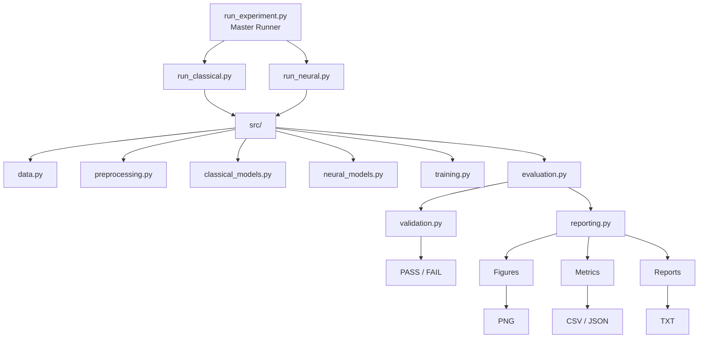
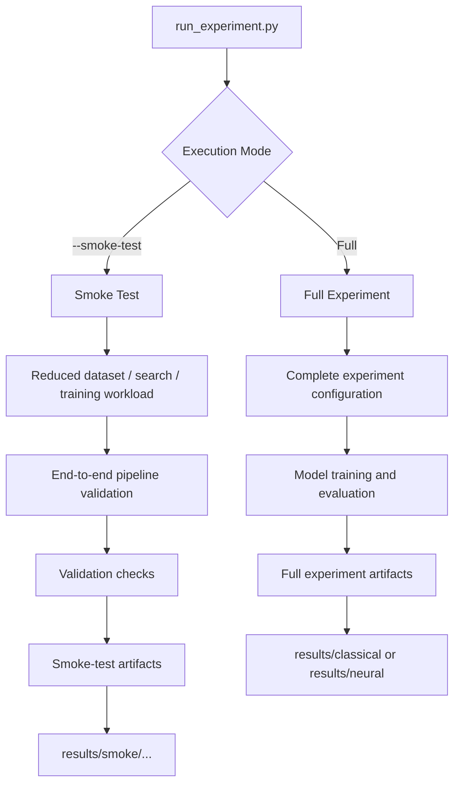

# IMDb Sentiment Classification

Comparative sentiment classification on the Stanford IMDb movie-review dataset using classical machine-learning and neural-network models, implemented as a modular and reproducible Python experimentation framework.

> **Project focus:** this repository develops an academic NLP experiment into a structured ML project for comparing classical and neural sentiment-classification approaches. It separates data preparation, modeling, training, evaluation, validation, and reporting while preserving the experimental analysis and learning behind the original notebook.

---

## Table of Contents

- [Overview](#overview)
- [Project Scope](#project-scope)
- [What This Project Demonstrates](#what-this-project-demonstrates)
- [Dataset](#dataset)
- [End-to-End Architecture](#end-to-end-architecture)
- [Modeling Strategy](#modeling-strategy)
- [Repository Structure](#repository-structure)
- [Design and Modularization](#design-and-modularization)
- [Experiment Execution](#experiment-execution)
- [Validation Strategy](#validation-strategy)
- [Generated Artifacts](#generated-artifacts)
- [Results and Key Observations](#results-and-key-observations)
- [Running the Project](#running-the-project)
- [Engineering Decisions and Learnings](#engineering-decisions-and-learnings)
- [Detailed Experiment Analysis](#detailed-experiment-analysis)
- [Limitations](#limitations)
- [Future Improvements](#future-improvements)
- [Technology Stack](#technology-stack)
- [Credits and Dataset](#credits-and-dataset)
- [License](#license)

---

## Overview

This project explores binary sentiment classification on the **Stanford IMDb Large Movie Review Dataset**, comparing four classical machine-learning models with four neural-network architectures.

### Classical Machine Learning

- Logistic Regression
- Bernoulli Naive Bayes
- LinearSVC
- Random Forest

### Neural Networks

- Vanilla RNN
- LSTM
- Bidirectional LSTM with FastText embeddings
- Self-Attention classifier

The work originally started as a Google Colab notebook developed for an academic machine-learning and deep-learning assignment. That notebook was useful for experimentation: model training, visualizations, comparisons, error analysis, and written reflection could all be explored in one place.

The GitHub version takes the next step.

Rather than treating the notebook as the final software structure, the reusable experiment logic has been reorganized into dedicated Python modules for:

- data loading
- text preprocessing
- model definitions
- neural training
- evaluation
- validation
- artifact generation and reporting
- experiment orchestration

The repository therefore keeps two complementary views of the work:

**The notebook captures the experimentation and learning process.  
The modular codebase captures the reusable engineering implementation.**

The goal is not only to compare model scores, but also to build an experiment that can be rerun, validated, inspected, and extended without depending on a single notebook execution.

---

## Project Scope

Version 1 focuses on establishing a complete and reproducible **model experimentation and evaluation workflow**.

### Included in v1

- Stanford IMDb binary sentiment classification
- four classical ML models
- four neural-network models
- classical hyperparameter search with `GridSearchCV`
- PyTorch-based neural training
- pretrained FastText embeddings for the BiLSTM experiment
- Accuracy, Precision, Recall, and F1 evaluation
- cross-validation results for classical models
- neural training-loss tracking
- confusion matrices
- runtime measurement
- model-comparison tables
- modular Python source code
- dedicated classical and neural experiment runners
- common master experiment runner
- reduced-cost smoke-test execution
- automated validation checks
- CPU/GPU-aware neural execution
- persistent experiment artifacts
- CSV and JSON metric exports
- human-readable experiment reports

### Outside the current v1 scope

Version 1 deliberately stops at the **validated experimentation layer**.

The following capabilities are candidates for later versions:

- persisted inference models
- REST inference API
- containerized model serving
- automated CI/CD
- cloud deployment
- model registry and experiment tracking
- automated retraining
- production observability
- model and data drift monitoring

These are intentionally separated from v1 so that the current repository can first establish a clear, reproducible, and technically validated modeling foundation.

---

## What This Project Demonstrates

The project is built around three related goals.

### 1. Comparing Different NLP Modeling Approaches

The same sentiment-classification problem is approached with models ranging from simple linear classifiers to recurrent and attention-based neural architectures.

This provides a practical comparison of how increasing model complexity affects:

- predictive performance
- training behavior
- computational cost
- generalization
- model errors

An important question throughout the experiment is not simply:

> *Which model is more complex?*

but rather:

> *What does the additional complexity actually provide for this task?*

---

### 2. Evaluating Models Beyond Accuracy

Accuracy alone does not describe how a classifier behaves.

The project therefore evaluates models using:

- Accuracy
- Precision
- Recall
- F1 score
- Confusion matrix

Classical experiments additionally preserve:

- cross-validation F1
- selected hyperparameters
- hyperparameter-search runtime

Neural experiments additionally preserve:

- trainable parameter count
- epoch-by-epoch training loss
- final training loss
- training runtime

This makes it possible to compare not only predictive performance, but also training behavior and computational cost.

---

### 3. Turning an Experimental Notebook into a Reusable ML Codebase

The original notebook naturally combined many responsibilities:

```text
data → preprocessing → models → training → evaluation → plots → analysis
```

For the repository version, these responsibilities were separated into reusable components:

```text
                         Experiment Runner
                                │
              ┌─────────────────┼─────────────────┐
              ▼                 ▼                 ▼
            Data            Modeling          Training
              │                                   │
              └─────────────────┬─────────────────┘
                                ▼
                            Evaluation
                                │
                    ┌───────────┴───────────┐
                    ▼                       ▼
                 Validation              Reporting
                    │                       │
                    ▼                       ▼
                PASS / FAIL        Figures / Metrics / Reports
```

The runners coordinate the workflow while the implementation details remain in dedicated modules.

This separation makes it easier to:

- test the complete pipeline before expensive full experiments
- change one part of the workflow without rewriting the rest
- preserve experiment outputs consistently
- introduce future inference or MLOps capabilities without rebuilding the project structure

## Dataset

This project uses the **Stanford IMDb Large Movie Review Dataset**, a balanced benchmark dataset for binary sentiment classification.

The labelled portion used in this project contains:

| Split | Reviews | Positive | Negative |
|---|---:|---:|---:|
| Training | 25,000 | 12,500 | 12,500 |
| Test | 25,000 | 12,500 | 12,500 |

Each review is labelled as either **positive (`1`)** or **negative (`0`)**.

The dataset is loaded programmatically through the Hugging Face `datasets` library:

```python
dataset = load_dataset("stanfordnlp/imdb")
```

The review data itself is therefore not stored in this repository. On the first execution, the dataset is downloaded and cached locally by the Hugging Face library.

### Why the Data Preparation Differs Between Model Families

Both experiment families start from the same IMDb reviews, but classical and neural models require different input representations.

#### Classical pipeline

```text
Raw IMDb Review
       │
       ▼
  Text Cleaning
       │
       ▼
 CountVectorizer
       │
       ▼
Classical Classifier
```

For the classical models, cleaned review text is converted into a sparse numerical representation before classification. Vectorization is kept inside the scikit-learn model pipeline so that preprocessing and model selection remain part of the same cross-validation workflow.

#### Neural pipeline

```text
Raw IMDb Review
       │
       ▼
   Tokenization
       │
       ▼
Vocabulary Lookup
       │
       ▼
Fixed-Length Token Sequence
       │
       ▼
PyTorch Dataset / DataLoader
       │
       ▼
   Neural Model
```

For the neural models, reviews are tokenized and converted into integer token sequences using a vocabulary built from the training data. The sequences are then padded or truncated to a fixed length before being passed to PyTorch `Dataset` and `DataLoader` components.

The current neural pipeline uses:

- maximum sequence length: `400`
- batch size: `64`
- padding token: `<PAD>`
- unknown token: `<UNK>`

Keeping the two preparation paths separate allows each model family to receive the representation it needs while still being evaluated against the same underlying train/test split.

## End-to-End Architecture

The repository supports two experiment paths—classical machine learning and neural networks—built on the same IMDb dataset but using different data representations and training workflows.

Both paths eventually converge on the same goal: evaluate the trained models and preserve the results as reproducible experiment artifacts.

### Experiment Workflow

<p align="center">
  
</p>

The two branches intentionally remain separate during data preparation and training.

The classical pipeline converts cleaned reviews into vectorized representations and performs model selection through `GridSearchCV`. The neural pipeline converts reviews into token sequences and feeds them through PyTorch `Dataset` and `DataLoader` components before training the neural architectures.

After training, both paths converge on evaluation and artifact generation. Experiment results are preserved as metrics, figures, and human-readable reports rather than existing only as terminal output.

This gives the project a common experiment structure while still allowing the classical and neural implementations to use the data representation and training workflow appropriate to each model family.

---

### Execution and Orchestration

Experiment execution is kept separate from the underlying modeling logic.



The three runner scripts have different responsibilities:

- `run_classical.py` orchestrates the classical model experiments.
- `run_neural.py` orchestrates the neural model experiments.
- `run_experiment.py` provides a common command-line entry point and delegates execution to the appropriate runner.

The master runner therefore does not contain model-training logic. Its responsibility is to select and launch the requested experiment path while the implementation remains in the dedicated runners and source modules.

This separation keeps command-line orchestration independent from model implementation and leaves room for other entry points—such as automated pipelines or an inference layer—to reuse the underlying modules later.

---

### Full Experiment vs Smoke-Test Execution

The same runner interface supports both full experiments and reduced-cost smoke tests.



A full experiment is intended to produce the model results used for comparison and analysis.

A smoke test answers a different question:

> **Can the complete pipeline execute successfully from data loading through artifact generation?**

The reduced workload makes it possible to verify the integration of the pipeline before committing the time and compute required for a full experiment.

Smoke-test artifacts are stored separately from full experiment artifacts so that a validation run cannot overwrite final experiment results.