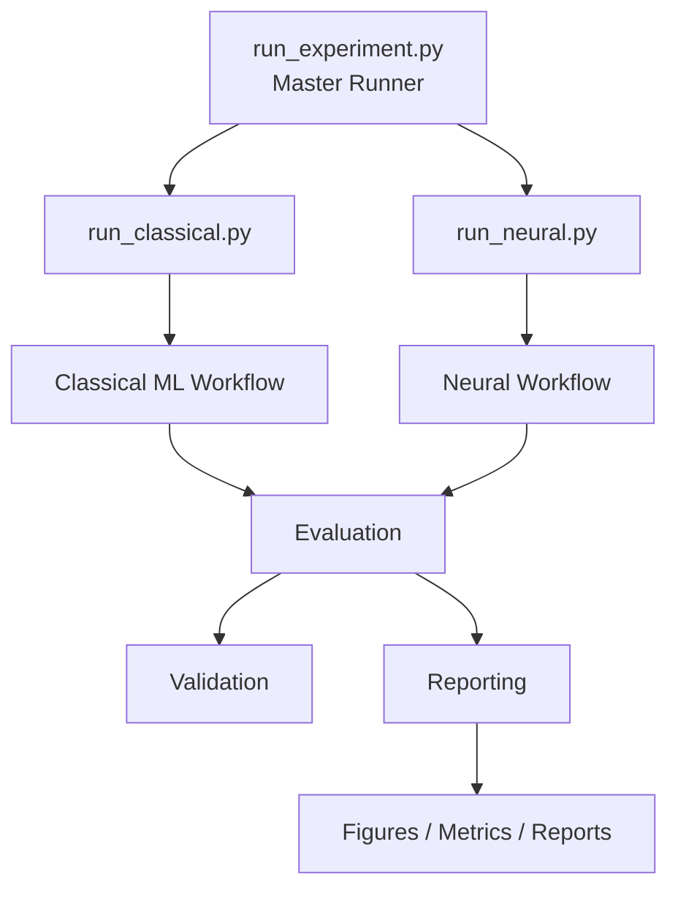

# IMDb Sentiment Classification

Comparative sentiment classification on the Stanford IMDb movie-review dataset using classical machine-learning and neural-network models, implemented as a modular and reproducible Python experimentation framework.

> **Project focus:** this repository develops an academic NLP experiment into a structured ML project for comparing classical and neural sentiment-classification approaches. It separates data preparation, modeling, training, evaluation, validation, and reporting while preserving the experimental analysis and learning behind the original notebook.

---

## Table of Contents

- [Overview](#overview)
- [Project Scope](#project-scope)
- [Quick Start](#quick-start)
- [Dataset](#dataset)
- [Architecture at a Glance](#architecture-at-a-glance)
- [Modeling Strategy](#modeling-strategy)
- [Repository Structure](#repository-structure)
- [Validation Strategy](#validation-strategy)
- [Results and Key Observations](#results-and-key-observations)
- [Documentation](#documentation)
- [Limitations](#limitations)
- [Future Improvements](#future-improvements)
- [Technology Stack](#technology-stack)
- [Acknowledgements](#acknowledgements)
- [License](#license)
- [Project Status](#project-status)

---

## Overview

This project explores binary sentiment classification on the **Stanford IMDb Large Movie Review Dataset**, comparing four classical machine-learning models with four neural-network architectures.

### Classical Machine Learning

- Logistic Regression
- Bernoulli Naive Bayes
- LinearSVC
- Random Forest

### Neural Networks

- Vanilla RNN
- LSTM
- Bidirectional LSTM with FastText embeddings
- Self-Attention classifier

The work originally started as a Google Colab notebook developed for an academic machine-learning and deep-learning assignment. That notebook was useful for experimentation: model training, visualizations, comparisons, error analysis, and written reflection could all be explored in one place.

The GitHub version takes the next step.

Rather than treating the notebook as the final software structure, the reusable experiment logic has been reorganized into dedicated Python modules for:

- data loading
- text preprocessing
- model definitions
- neural training
- evaluation
- validation
- artifact generation and reporting
- experiment orchestration

The repository therefore keeps two complementary views of the work:

**The notebook captures the experimentation and learning process.  
The modular codebase captures the reusable engineering implementation.**

The goal is not only to compare model scores, but also to build an experiment that can be rerun, validated, inspected, and extended without depending on a single notebook execution.

---

## Project Scope

Version 1 focuses on establishing a complete and reproducible **model experimentation and evaluation workflow**.

### Included in v1

- Stanford IMDb binary sentiment classification
- four classical ML models
- four neural-network models
- classical hyperparameter search with `GridSearchCV`
- PyTorch-based neural training
- pretrained FastText embeddings for the BiLSTM experiment
- Accuracy, Precision, Recall, and F1 evaluation
- cross-validation results for classical models
- neural training-loss tracking
- confusion matrices
- runtime measurement
- model-comparison tables
- modular Python source code
- dedicated classical and neural experiment runners
- common master experiment runner
- reduced-cost smoke-test execution
- automated validation checks
- CPU/GPU-aware neural execution
- persistent experiment artifacts
- CSV and JSON metric exports
- human-readable experiment reports

### Outside the current v1 scope

Version 1 deliberately stops at the **validated experimentation layer**.

The following capabilities are candidates for later versions:

- persisted inference models
- REST inference API
- containerized model serving
- automated CI/CD
- cloud deployment
- model registry and experiment tracking
- automated retraining
- production observability
- model and data drift monitoring

These are intentionally separated from v1 so that the current repository can first establish a clear, reproducible, and technically validated modeling foundation.

---

## Quick Start

### Tested Environment

This v1.0 release has been tested with:

- **Python:** 3.13.14
- **Operating system:** Windows
- **Execution:** CPU; CUDA is automatically used when available for neural experiments
- **Dependencies:** pinned in `requirements.txt`

> **Compatibility note:** Python 3.14 is currently not recommended for this release because the FastText/Gensim dependency path previously encountered compatibility issues with that version.

Clone the repository:

```bash
git clone https://github.com/sharadshukla/imdb-sentiment-classification.git
cd imdb-sentiment-classification
```

### 1. Create a virtual environment

```bash
python -m venv .venv
```

### 2. Activate the environment

**Windows — PowerShell**

```powershell
.venv\Scripts\Activate.ps1
```

**Windows — Command Prompt**

```cmd
.venv\Scripts\activate.bat
```

**macOS / Linux**

```bash
source .venv/bin/activate
```

### 3. Install dependencies

```bash
python -m pip install --upgrade pip
pip install -r requirements.txt
```

### 4. Run a smoke test

For the quickest end-to-end validation, start with the classical pipeline:

```bash
python scripts/run_experiment.py --mode classical --smoke-test
```

To validate the complete neural pipeline:

```bash
python scripts/run_experiment.py --mode neural --smoke-test
```

The smoke tests use reduced workloads and are intended to verify pipeline integration rather than benchmark model performance.

### 5. Run the full experiments

Full classical experiment:

```bash
python scripts/run_experiment.py --mode classical
```

Full neural experiment:

```bash
python scripts/run_experiment.py --mode neural
```

The neural runner automatically uses a CUDA GPU when available and otherwise falls back to CPU.

> **Recommended workflow:** run the corresponding smoke test successfully before launching a full experiment. The full neural experiment is substantially faster on a CUDA-capable GPU.

Generated artifacts are written under:

```text
results/
├── full/
│   ├── classical/
│   └── neural/
└── smoke/
    ├── classical/
    └── neural/
```

## Dataset

This project uses the **[Stanford IMDb Large Movie Review Dataset](https://ai.stanford.edu/~amaas/data/sentiment/)**, a balanced benchmark dataset for binary sentiment classification introduced by Maas et al.

The labelled portion used in this project contains:

| Split | Reviews | Positive | Negative |
|---|---:|---:|---:|
| Training | 25,000 | 12,500 | 12,500 |
| Test | 25,000 | 12,500 | 12,500 |

Each review is labelled as either **positive (`1`)** or **negative (`0`)**.

The dataset is loaded programmatically through the Hugging Face `datasets` library using the [`stanfordnlp/imdb`](https://huggingface.co/datasets/stanfordnlp/imdb) dataset:

```python
dataset = load_dataset("stanfordnlp/imdb")
```

The review data itself is therefore not stored in this repository. On the first execution, the dataset is downloaded and cached locally by the Hugging Face library.

### Why the Data Preparation Differs Between Model Families

Both experiment families start from the same IMDb reviews, but classical and neural models require different input representations.

#### Classical pipeline

```text
Raw IMDb Review
       │
       ▼
  Text Cleaning
       │
       ▼
 CountVectorizer
       │
       ▼
Classical Classifier
```

For the classical models, cleaned review text is converted into a sparse numerical representation before classification. Vectorization is kept inside the scikit-learn model pipeline so that preprocessing and model selection remain part of the same cross-validation workflow.

#### Neural pipeline

```text
Raw IMDb Review
       │
       ▼
   Tokenization
       │
       ▼
Vocabulary Lookup
       │
       ▼
Fixed-Length Token Sequence
       │
       ▼
PyTorch Dataset / DataLoader
       │
       ▼
   Neural Model
```

For the neural models, reviews are tokenized and converted into integer token sequences using a vocabulary built from the training data. The sequences are then padded or truncated to a fixed length before being passed to PyTorch `Dataset` and `DataLoader` components.

The current neural pipeline uses:

- maximum sequence length: `400`
- batch size: `64`
- padding token: `<PAD>`
- unknown token: `<UNK>`

Keeping the two preparation paths separate allows each model family to receive the representation it needs while still being evaluated against the same underlying train/test split.

## Architecture at a Glance

The repository keeps the classical and neural experiment paths separate where their data representation and training workflows genuinely differ, while sharing evaluation, validation, reporting, and a common command-line entry point.



For the deeper module boundaries, runner design, full-vs-smoke execution, artifact architecture, and engineering decisions, see **[Architecture Documentation](docs/architecture/README.md)**.

---

## Modeling Strategy

The experiment compares models with different assumptions about how sentiment can be represented and learned from text.

Rather than treating increasing architectural complexity as automatically better, the models are compared under the same binary sentiment-classification task to see what each approach contributes in practice.

The modeling strategy progresses from sparse feature-based classifiers to recurrent sequence models and finally to an attention-based architecture.

### Classical Machine-Learning Models

The classical pipeline uses `CountVectorizer` to transform cleaned reviews into sparse numerical features and evaluates four classifiers.

| Model | Role in the Experiment |
|---|---|
| **Logistic Regression** | Strong and interpretable linear baseline for high-dimensional sparse text |
| **Bernoulli Naive Bayes** | Probabilistic baseline based primarily on binary word occurrence |
| **LinearSVC** | Margin-based linear classifier well suited to high-dimensional text features |
| **Random Forest** | Non-linear tree-ensemble comparison against the linear approaches |

Each classifier is combined with text vectorization inside a scikit-learn `Pipeline`.

Model selection is performed using `GridSearchCV`, with **F1 score** as the optimization metric.

Conceptually:

```text
Cleaned Review
      │
      ▼
CountVectorizer
      │
      ▼
Classifier
      │
      ▼
GridSearchCV
      │
      ▼
Best Estimator
      │
      ▼
Held-Out Test Evaluation
```

Keeping vectorization inside the pipeline is important because the vectorizer is fitted independently within each cross-validation training fold rather than being fitted once on all training data before model selection.

The final selected estimator is then evaluated against the untouched IMDb test split.

---

### Neural-Network Models

The neural experiments explore progressively different ways of representing sequential information and context.

#### Vanilla RNN

The RNN provides the simplest recurrent baseline.

```text
Token IDs
    │
    ▼
Embedding
    │
    ▼
2-Layer RNN
    │
    ▼
Final Hidden State
    │
    ▼
Dropout
    │
    ▼
Linear Classifier
```

It processes the review sequentially and uses the recurrent hidden representation for binary sentiment prediction.

Its inclusion provides a useful baseline for observing what changes when stronger mechanisms for retaining contextual information are introduced.

---

#### LSTM

The LSTM keeps the recurrent structure but introduces gating mechanisms for controlling what information is retained, updated, or forgotten while processing the sequence.

```text
Token IDs
    │
    ▼
Embedding
    │
    ▼
2-Layer LSTM
    │
    ▼
Final Hidden State
    │
    ▼
Dropout
    │
    ▼
Linear Classifier
```

Comparing the LSTM with the vanilla RNN provides a direct experiment in whether improved long-range information handling translates into better sentiment classification.

---

#### Bidirectional LSTM + FastText

The BiLSTM experiment introduces two additional ideas:

1. **bidirectional sequence processing**, allowing the representation to incorporate information from both directions
2. **pretrained FastText embeddings**, providing word representations learned from a much larger external corpus

```text
Token IDs
      │
      ▼
FastText Embeddings
      │
      ▼
Bidirectional LSTM
      │
      ▼
Forward + Backward
Hidden Representations
      │
      ▼
Concatenation
      │
      ▼
Dropout
      │
      ▼
Linear → ReLU → Linear
      │
      ▼
Sentiment Prediction
```

The FastText embedding layer remains trainable, allowing the pretrained representations to be adjusted during sentiment-model training.

This model is useful not only for comparing predictive performance, but also for examining whether stronger representation learning and substantially greater model capacity necessarily improve generalization.

---

#### Self-Attention

The final neural architecture replaces recurrence with a self-attention mechanism.

```text
Token Embeddings
       +
Positional Encoding
        │
        ▼
LayerNorm + Dropout
        │
        ▼
Learnable CLS Token
        │
        ▼
Multi-Head Self-Attention
        │
        ▼
CLS Representation
        │
        ▼
LayerNorm
        │
        ▼
Linear → GELU → Dropout → Linear
        │
        ▼
Sentiment Prediction
```

Unlike the recurrent models, self-attention can directly model relationships between different positions in the review without processing those relationships only through a recurrent hidden state.

A learnable classification token (`CLS`) is used to collect information from the sequence before the final classification layers.

The architecture is referred to as **Self-Attention** throughout this repository because the queries, keys, and values are derived from the same input sequence.

---

### What the Comparison Is Intended to Show

The eight models are not included simply to create a larger benchmark table.

Together, they allow the experiment to examine several questions:

- How competitive are sparse linear models on IMDb sentiment classification?
- How much does LSTM improve over a basic RNN?
- Do pretrained embeddings and bidirectional recurrence improve held-out performance?
- Does lower neural training loss necessarily mean better generalization?
- How does Self-Attention compare with recurrent architectures?
- How much additional runtime and model complexity accompanies any improvement in predictive performance?

These questions become especially useful when the performance metrics, training behavior, and runtime are examined together rather than ranking models by a single score.

## Repository Structure

```text
imdb-sentiment-classification/
│
├── scripts/
│   ├── run_experiment.py
│   ├── run_classical.py
│   └── run_neural.py
│
├── src/
│   ├── __init__.py
│   ├── data.py
│   ├── preprocessing.py
│   ├── classical_models.py
│   ├── neural_models.py
│   ├── training.py
│   ├── evaluation.py
│   ├── reporting.py
│   ├── validation.py
│   └── utils.py
│
├── results/
│   ├── full/
│   │   ├── classical/
│   │   └── neural/
│   └── smoke/
│       ├── classical/
│       └── neural/
│
├── docs/
│   ├── architecture/
│   │   └── README.md
│   ├── images/
│   │   ├── experiment-architecture.svg
│   │   └── experiment-results/
│   │       ├── neural_loss_comparison.png
│   │       ├── rnn_confusion_matrix.png
│   │       └── self_attention_confusion_matrix.png
│   └── experiment_analysis.md
│
├── requirements.txt
├── .gitignore
└── README.md
```

Each full or smoke experiment family creates its own `figures/`, `metrics/`, and `reports/` directories when needed. Generated `results/` content is excluded from source control; permanent documentation assets belong under `docs/images/`.

---

## Validation Strategy

Full ML experiments can be expensive enough that discovering an integration problem after a long training run is wasteful.

For that reason, the repository provides a reduced-cost **smoke-test mode** for both experiment families.

The smoke test is designed to answer:

> **Can the complete experiment pipeline execute successfully from data loading through artifact generation?**

It is deliberately **not** designed to answer:

> **How well does this model perform?**

That distinction is important because smoke tests use reduced workloads specifically to provide faster feedback.

---

### Classical Smoke Test

Run:

```bash
python scripts/run_experiment.py --mode classical --smoke-test
```

The classical smoke test reduces the cost of the full workflow by using:

- `2,000` training reviews
- `1,000` test reviews
- `2` cross-validation folds
- one hyperparameter configuration per model

The pipeline still exercises all four classical models:

- Logistic Regression
- Bernoulli Naive Bayes
- LinearSVC
- Random Forest

and continues through evaluation, artifact generation, and automated validation.

The current smoke-test result is:

```text
Result: 19/19 checks passed

SMOKE TEST: PASSED
```

The checks cover:

- IMDb dataset loading
- balanced smoke-test labels
- text preprocessing
- valid F1 scores
- valid cross-validation F1 scores
- confusion-matrix generation for all four models
- inclusion of all four models in the final comparison
- comparison CSV generation
- comparison JSON generation
- experiment report generation

---

### Neural Smoke Test

Run:

```bash
python scripts/run_experiment.py --mode neural --smoke-test
```

The neural smoke test uses:

- `1,000` training reviews
- `500` test reviews
- `2` training epochs
- temporary `300`-dimensional embeddings for the BiLSTM path

The temporary embedding matrix is intentional.

Downloading and preparing the full pretrained FastText vectors would add substantial cost to a test whose purpose is simply to verify that the BiLSTM embedding path, model training, evaluation, and artifact generation work correctly.

The real FastText embeddings remain part of the **full neural experiment**.

All four neural architectures are exercised:

- RNN
- LSTM
- BiLSTM + FastText-compatible embedding path
- Self-Attention

The current smoke-test result is:

```text
Result: 35/35 checks passed

SMOKE TEST: PASSED
```

The checks cover:

- IMDb dataset loading
- balanced smoke-test labels
- vocabulary creation
- PyTorch DataLoader creation
- completion of all four model-training paths
- valid F1 scores
- valid final training losses
- individual training-loss figures
- confusion matrices
- BiLSTM embedding-matrix creation
- inclusion of all four neural models in the final comparison
- comparison CSV generation
- comparison JSON generation
- training-loss CSV generation
- combined loss-comparison figure
- experiment report generation
- valid training and test sequence lengths
- presence of variable-length sequences
- zero-valued PAD embedding for the BiLSTM embedding matrix

---

### What a Passing Smoke Test Means

A passing smoke test provides evidence that the major components of the experiment work together:

```text
Data Loading
     ↓
Preprocessing
     ↓
Model Construction
     ↓
Training
     ↓
Evaluation
     ↓
Artifact Generation
     ↓
Validation
     ↓
PASS / FAIL
```

It does **not** certify that the model has reached useful predictive performance.

For example, a neural model trained for only two epochs on a small smoke-test subset may produce poor or highly skewed predictions while the pipeline itself is functioning correctly.

The validation checks therefore focus primarily on:

- successful execution
- valid outputs
- expected model coverage
- expected artifact generation

rather than imposing benchmark-performance thresholds on smoke-test models.

---

### Smoke-Test Results Are Isolated

Validation runs write their artifacts to separate paths:

```text
results/smoke/classical/
results/smoke/neural/
```

Full experiment outputs use their corresponding full-result locations.

This separation prevents a quick smoke test from overwriting or being mistaken for the results of a complete experiment.

It also makes the purpose of an artifact clear when inspecting the repository later.

## Results and Key Observations

The experiments compare predictive performance across classical machine-learning and neural-network approaches while also highlighting differences in training behavior, model complexity, and computational cost.

The classical results below come from the full modularized classical experiment. The neural results come from the finalized full modularized neural experiment, executed on the complete IMDb training and test splits using a Tesla T4 GPU.

### Classical Model Comparison

| Model | Accuracy | Precision | Recall | F1 Score | CV F1 | Runtime |
|---|---:|---:|---:|---:|---:|---:|
| **LinearSVC** | **0.8746** | **0.8719** | 0.8782 | **0.8750** | 0.8615 | 3.60 min |
| **Logistic Regression** | 0.8734 | 0.8658 | **0.8839** | 0.8748 | **0.8663** | **1.46 min** |
| **Random Forest** | 0.8530 | 0.8463 | 0.8627 | 0.8544 | 0.8519 | 54.16 min |
| **Bernoulli Naive Bayes** | 0.8232 | 0.8683 | 0.7619 | 0.8117 | 0.7985 | 1.59 min |

The complete modularized classical experiment finished in approximately **76.9 minutes** on the local CPU environment used for the run.

Two models stand out immediately.

**LinearSVC achieved the highest held-out F1 score at `0.8750`, while Logistic Regression reached `0.8748`.** The difference is only `0.0002`, so the result is more useful as evidence that both linear classifiers are highly competitive than as evidence of a meaningful performance gap.

Logistic Regression also achieved the highest recall (`0.8839`) and completed its hyperparameter search considerably faster than LinearSVC in this run.

Random Forest remained competitive at `0.8544` F1, but its search required approximately `54.16` minutes without improving on either linear classifier.

Bernoulli Naive Bayes produced relatively strong precision (`0.8683`) but substantially lower recall (`0.7619`), resulting in the lowest classical F1 score.

### Cross-Validation vs Held-Out Performance

| Model | Best CV F1 | Test F1 |
|---|---:|---:|
| Logistic Regression | **0.8663** | 0.8748 |
| LinearSVC | 0.8615 | **0.8750** |
| Random Forest | 0.8519 | 0.8544 |
| Bernoulli Naive Bayes | 0.7985 | 0.8117 |

The held-out results remain reasonably close to the cross-validation scores across the four classical models.

This is useful because the comparison is based not only on the final test result: model selection was performed independently through cross-validation before the selected estimator was evaluated against the held-out test set.

---

### Finalized Neural Model Comparison

The finalized full neural experiment trained each architecture for `10` epochs on all `25,000` training reviews and evaluated it on all `25,000` held-out test reviews.

| Model | Accuracy | Precision | Recall | F1 Score | Trainable Parameters | Final Training Loss | Runtime |
|---|---:|---:|---:|---:|---:|---:|---:|
| **Self-Attention** | **0.8636** | 0.8722 | 0.8519 | **0.8620** | 3,802,753 | 0.2010 | 2.79 min |
| **LSTM** | 0.8622 | **0.8735** | 0.8470 | 0.8601 | 4,649,601 | 0.0339 | 3.48 min |
| **BiLSTM + FastText** | 0.8476 | 0.8375 | **0.8624** | 0.8498 | 11,588,229 | **0.0147** | 7.93 min |
| **Vanilla RNN** | 0.7802 | 0.7861 | 0.7699 | 0.7779 | 3,958,401 | 0.4436 | **2.46 min** |

FastText preparation required approximately `6.86` minutes, and the complete neural experiment finished in approximately **24.56 minutes** on the Tesla T4.

The corrected full experiment was also executed twice under the same configuration and reproduced the same evaluation metrics and epoch-level training losses. This is useful reproducibility evidence for the tested configuration, although it is not a substitute for a controlled multi-seed variance study.

---

### Correct Sequence Handling Materially Changed the Recurrent Results

During the repository review, recurrent sequence handling was corrected so that the RNN-based models use the true sequence lengths and packed recurrent processing rather than allowing padded timesteps to influence the final recurrent representation.

The correction materially changed the recurrent-model results:

| Model | Earlier F1 | Finalized F1 |
|---|---:|---:|
| Vanilla RNN | 0.4874 | **0.7779** |
| LSTM | 0.7906 | **0.8601** |
| BiLSTM + FastText | 0.7813 | **0.8498** |
| Self-Attention | 0.8601 | **0.8620** |

The Vanilla RNN therefore remains the weakest neural architecture, but it is no longer a near-random classifier. This correction is an important experimental lesson: implementation details can materially affect measured model behavior and the conclusions drawn from an architectural comparison.

---

### LSTM Still Clearly Outperformed the Vanilla RNN

With sequence handling corrected consistently, the comparison became:

```text
Vanilla RNN F1 : 0.7779
LSTM F1        : 0.8601
Improvement    : +0.0822
```

The LSTM therefore retained a clear advantage over the Vanilla RNN, but the finalized comparison is considerably more credible than the earlier result because padded timesteps no longer confound the recurrent representation.

---

### BiLSTM + FastText Fit the Training Objective Most Strongly — but Did Not Generalize Best

The BiLSTM + FastText model achieved the lowest final training loss:

```text
Final training loss : 0.0147
Test F1             : 0.8498
```

It also had the largest capacity at approximately **11.6 million trainable parameters** and achieved `90.3%` FastText vocabulary coverage.

However, its held-out F1 remained below both LSTM (`0.8601`) and Self-Attention (`0.8620`).

This provides a concrete example of why training loss alone should not determine model selection. The combination of very low training loss, high capacity, and comparatively weaker held-out performance is consistent with a generalization gap, although the current workflow does not include a dedicated validation-loss curve that would establish the precise onset or magnitude of overfitting.

Because bidirectionality and pretrained FastText embeddings were introduced together, their individual contributions cannot be isolated from this experiment alone. A controlled ablation would be required.

---

### Self-Attention Was the Strongest Neural Model

Self-Attention achieved the strongest finalized neural F1:

```text
Accuracy  : 0.8636
Precision : 0.8722
Recall    : 0.8519
F1        : 0.8620
```

LSTM was extremely close:

```text
LSTM F1           : 0.8601
Self-Attention F1 : 0.8620
Difference        : 0.0019
```

The experiment therefore supports describing Self-Attention as the strongest neural model in this run, but not as substantially superior to LSTM. Establishing whether such a small difference is statistically reliable would require repeated experiments across multiple random seeds.

The attention analysis also inspected attention-weight patterns for selected examples. In some correctly classified reviews, stronger attention appeared around evaluative or sentiment-bearing relationships; in some misclassified reviews, locally strong expressions did not align with the overall review sentiment.

These patterns are treated as **diagnostic evidence rather than causal explanations**. Attention weights alone do not establish why a prediction was made; the prediction emerges from the complete learned representation, including token embeddings, positional information, attention-transformed representations, the aggregated `CLS` representation, normalization, and downstream classification layers.

---

### Training Loss vs Generalization

The finalized neural results make the distinction between training fit and held-out performance particularly visible:

| Model | Final Training Loss | Test F1 |
|---|---:|---:|
| BiLSTM + FastText | **0.0147** | 0.8498 |
| LSTM | 0.0339 | 0.8601 |
| Self-Attention | 0.2010 | **0.8620** |
| Vanilla RNN | 0.4436 | 0.7779 |

BiLSTM + FastText and LSTM both drove the training objective substantially lower than Self-Attention, yet Self-Attention achieved the strongest neural held-out F1.

Training loss and held-out metrics therefore need to be interpreted together rather than assuming that the model fitting the training data most strongly is automatically the better classifier.

---

### Classical vs Neural: Complexity Did Not Automatically Win

The strongest result across the complete comparison remained the classical LinearSVC:

| Model | Family | F1 Score |
|---|---|---:|
| **LinearSVC** | Classical | **0.8750** |
| Logistic Regression | Classical | 0.8748 |
| Self-Attention | Neural | 0.8620 |
| LSTM | Neural | 0.8601 |
| Random Forest | Classical | 0.8544 |
| BiLSTM + FastText | Neural | 0.8498 |
| Bernoulli Naive Bayes | Classical | 0.8117 |
| Vanilla RNN | Neural | 0.7779 |

For this IMDb experiment, **LinearSVC achieved the highest F1 score while remaining substantially simpler than the neural alternatives.**

Self-Attention and LSTM came close to the strongest classical baselines, but neither exceeded LinearSVC or Logistic Regression.

For a practical deployment decision based on these experiments alone, LinearSVC would therefore be a strong candidate because it combines:

- the highest observed F1
- relatively low model complexity
- efficient inference
- comparatively straightforward deployment and maintenance

The neural experiments remain valuable because they expose behaviors that the classical models cannot demonstrate as directly: recurrent sequence modeling, gated memory, pretrained representation learning, bidirectional context, self-attention, and the relationship between training fit and generalization.

---

### Error Analysis: Why Sentiment Classification Is Still Difficult

The best overall model, LinearSVC, was also examined through false-positive and false-negative predictions.

Several errors involved reviews containing **mixed sentiment**.

For example, some negative reviews contained locally positive expressions such as:

```text
"worth the entertainment value"
"entertaining"
"decent film"
```

while ultimately expressing criticism.

Conversely, some positive reviews discussed difficult or negative themes using words that appeared unfavorable even though the reviewer appreciated the film overall.

This exposes a fundamental limitation of presence-based text representations: a model can learn that certain words correlate strongly with positive or negative sentiment without fully understanding how those words contribute to the overall meaning of a long review.

The attention experiment showed a related challenge. Attention can model relationships and emphasize important parts of the sequence, but focusing strongly on particular token relationships does not guarantee that the complete sentiment of a complex review has been captured.

---

### Main Takeaway

The finalized experiments demonstrate several complementary lessons:

- strong classical baselines remain essential for text classification
- correct sequence handling materially affects recurrent-model conclusions
- LSTM gating still provides a clear advantage over the Vanilla RNN under the corrected implementation
- lower training loss does not guarantee stronger held-out performance
- pretrained embeddings and greater model capacity do not automatically improve generalization
- Self-Attention provides the strongest neural result, although LSTM is very close
- model selection should consider predictive quality together with computational cost, complexity, inference requirements, and maintainability

For this experiment, **LinearSVC provides the strongest overall held-out F1, while Self-Attention provides the strongest neural F1.**

The deeper model-by-model analysis, training behavior, attention observations, implementation-correction impact, and experiment limitations are documented in:

[`docs/experiment_analysis.md`](docs/experiment_analysis.md)


## Documentation

The documentation is split by purpose so the root README remains an entry point rather than becoming the entire technical record.

- **[Architecture Documentation](docs/architecture/README.md)** — module boundaries, orchestration, classical vs neural workflow design, validation, reporting, artifact layout, architectural decisions, and extension points.
- **[Detailed Experiment Analysis](docs/experiment_analysis.md)** — model-specific training behavior, metric interpretation, attention observations, error analysis, generalization findings, and experiment limitations.

---

## Limitations

This project was designed primarily as an experimental and educational NLP codebase rather than as a production sentiment-analysis service.

Several limitations are therefore intentional and provide useful directions for future work.

### Neural Variance Has Not Been Measured Across Random Seeds

Neural-network training can involve stochastic effects from parameter initialization, mini-batch ordering, hardware behavior, and related factors.

The finalized neural experiment was executed twice under the same tested configuration and reproduced the same evaluation metrics and epoch-level training losses. However, these runs were not a controlled multi-seed study.

Repeated experiments across multiple random seeds would be needed to estimate mean performance, variance, and the statistical stability of small differences such as the `0.0019` F1 gap between Self-Attention and LSTM.

---

### No Dedicated Validation Split for Neural Model Selection

The neural experiments focus on comparing architectures and observing their training behavior.

A more rigorous model-development workflow would introduce a dedicated validation split for decisions such as:

- epoch selection
- learning-rate tuning
- architecture tuning
- regularization
- early stopping

The held-out test set should ideally remain untouched until the final model-selection process is complete.

---

### BiLSTM and FastText Were Introduced Together

The BiLSTM experiment combines two changes:

- bidirectional recurrence
- pretrained FastText embeddings

Because both were introduced in the same experiment, the observed performance cannot be attributed independently to either change.

A controlled ablation study would be required to compare, for example:

```text
LSTM + learned embeddings
BiLSTM + learned embeddings
LSTM + FastText
BiLSTM + FastText
```

This would make it possible to isolate the contribution of bidirectionality and pretrained embeddings.

---

### Limited Neural Hyperparameter Exploration

The neural architectures were implemented primarily to compare different modeling approaches rather than to perform exhaustive hyperparameter optimization.

Parameters such as:

- hidden dimensions
- number of layers
- dropout
- learning rate
- sequence length
- batch size
- optimizer configuration

could be explored more systematically.

The neural results therefore represent the implemented experiment configurations rather than the maximum achievable performance of each architecture.

---

### Classical and Neural Feature Representations Are Fundamentally Different

The classical models operate on sparse vectorized text representations, while the neural models learn from token sequences and embeddings.

Their comparison is useful from an engineering perspective, but it should not be interpreted as a perfectly controlled comparison in which only the classifier architecture changes.

Each modeling family uses a different representation and optimization strategy.

---

### The Project Currently Stops at Experimentation

The repository currently covers:

```text
data
  ↓
preprocessing
  ↓
training
  ↓
evaluation
  ↓
validation
  ↓
experiment artifacts
```

It does not yet provide a production inference service, model registry, deployment pipeline, monitoring system, or automated retraining workflow.

Those concerns belong to a later productionization/MLOps layer rather than being artificially added to the initial experimental implementation.

---

## Future Improvements

The current modular structure provides a foundation for extending the project without reorganizing the entire experiment codebase.

Possible future improvements include the following.

### Model Persistence and Inference

Persist selected trained models and their required preprocessing artifacts so that predictions can be performed without retraining.

A lightweight inference interface could then expose functionality such as:

```text
review text
    ↓
preprocessing
    ↓
saved model
    ↓
sentiment prediction
```

---

### FastAPI Inference Service

A future version could expose the selected model through a small REST API.

For example:

```http
POST /predict
```

with a review as input and sentiment prediction as output.

This would turn the experiment into a reusable inference component while keeping API concerns separate from model training.

---

### Containerization

The inference service could be packaged using Docker to provide a consistent runtime environment.

This would make the application easier to:

- run locally
- test consistently
- deploy to cloud infrastructure
- integrate into CI/CD workflows

---

### Automated Testing and CI

The existing smoke-test and validation architecture provides a natural starting point for continuous integration.

A future CI workflow could automatically execute lightweight validation whenever relevant code changes.

For example:

```text
Git Push / Pull Request
        ↓
Install Dependencies
        ↓
Run Lightweight Validation
        ↓
PASS / FAIL
```

The existing smoke tests already provide much of the application-level behavior needed for such a workflow.

---

### Experiment Tracking

As the number of experiments grows, structured experiment tracking could replace manual comparison of generated artifacts.

A future version could track:

- model configuration
- hyperparameters
- dataset version
- metrics
- training runtime
- artifacts
- model version

using an experiment-tracking platform such as MLflow or an equivalent service.

---

### Controlled Neural Ablation Studies

Additional experiments could isolate individual architectural choices.

Examples include:

```text
Unidirectional vs Bidirectional LSTM

Random embeddings vs FastText embeddings

Frozen vs trainable pretrained embeddings

Recurrent models vs Self-Attention
```

These experiments would allow stronger conclusions about why individual architectural changes affect performance.

---

### Regularization and Early Stopping

BiLSTM + FastText and LSTM achieved very low final training losses without outperforming Self-Attention on held-out F1.

Future experiments could investigate techniques such as:

- dropout tuning
- weight decay
- early stopping
- learning-rate scheduling

to study whether stronger regularization improves generalization.

---

### Lightweight MLOps and Cloud Deployment

A later version could extend the project from experimentation into a lightweight end-to-end ML lifecycle:

```text
Source Code
    ↓
Automated Validation
    ↓
Model Training
    ↓
Model Artifact
    ↓
Inference API
    ↓
Container
    ↓
Cloud Deployment
    ↓
Basic Monitoring
```

The intention would not be to turn a small sentiment-classification project into an unnecessarily complex platform.

Instead, the goal would be to demonstrate the connection between **ML experimentation and production delivery** using the existing modular structure.

---

## Technology Stack

The project intentionally uses a relatively focused stack so that the modeling and engineering workflow remains easy to understand.

| Area | Technology |
|---|---|
| Language | Python |
| Classical ML | scikit-learn |
| Neural Networks | PyTorch |
| Dataset Access | Hugging Face Datasets |
| Text Representation | CountVectorizer / token sequences |
| Pretrained Embeddings | FastText |
| Data Processing | NumPy, pandas |
| Evaluation | scikit-learn metrics |
| Visualization | Matplotlib |
| Experiment Outputs | CSV, JSON, TXT, PNG |
| Version Control | Git / GitHub |

### Modeling Stack

```text
Classical NLP
    └── scikit-learn
        ├── Logistic Regression
        ├── Bernoulli Naive Bayes
        ├── LinearSVC
        └── Random Forest

Neural NLP
    └── PyTorch
        ├── Vanilla RNN
        ├── LSTM
        ├── BiLSTM + FastText
        └── Self-Attention
```

The project deliberately avoids introducing additional frameworks where the existing stack already provides the required functionality.

This keeps the repository focused on the experiment itself while leaving infrastructure and production tooling for later iterations.

## Acknowledgements

This project was developed as part of my hands-on learning in machine learning, deep learning, and natural language processing.

The original implementation began as an experimental notebook covering classical text classification, recurrent neural networks, pretrained embeddings, attention mechanisms, model evaluation, and error analysis.

The repository extends that work by reorganizing the experiment into a modular and reproducible Python codebase with:

- reusable model and training components
- dedicated experiment runners
- automated smoke-test validation
- persistent experiment artifacts
- structured reporting
- documentation of both engineering and ML learnings

### Dataset

The sentiment-classification experiments use the **[Stanford IMDb Large Movie Review Dataset](https://ai.stanford.edu/~amaas/data/sentiment/)**, introduced by Maas et al. in *Learning Word Vectors for Sentiment Analysis*.

### Libraries and Ecosystem

The implementation builds on open-source tools including:

- PyTorch
- scikit-learn
- Hugging Face Datasets
- [FastText](https://fasttext.cc/)
- NumPy
- pandas
- Matplotlib

These libraries provide the modeling, data-processing, evaluation, and visualization foundations used throughout the project.

## License

This project is intended for educational and portfolio purposes.

A formal open-source license has not yet been added to the repository.

## Project Status

**Version 1 — Experimentation and Modularization**

The current version covers the complete experimentation layer:

```text
IMDb Dataset
     ↓
Preprocessing
     ↓
Classical + Neural Modeling
     ↓
Training
     ↓
Evaluation
     ↓
Smoke-Test Validation
     ↓
Persistent Experiment Artifacts
     ↓
Documented Results and Analysis
```

The core experiment pipeline is implemented and validated.

Potential later versions may extend the project toward inference, containerization, CI/CD, cloud deployment, experiment tracking, and lightweight MLOps while keeping the existing experimentation layer intact.
