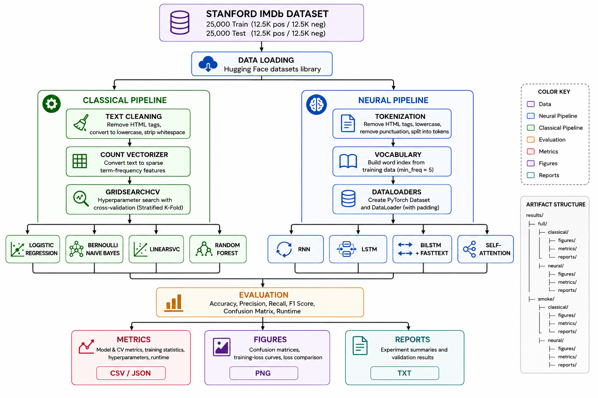
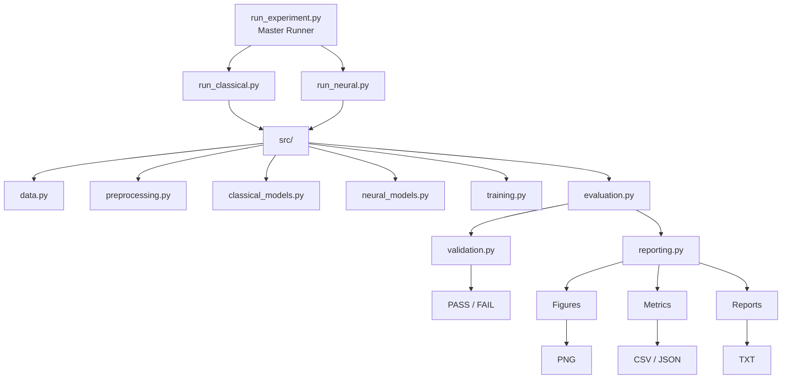
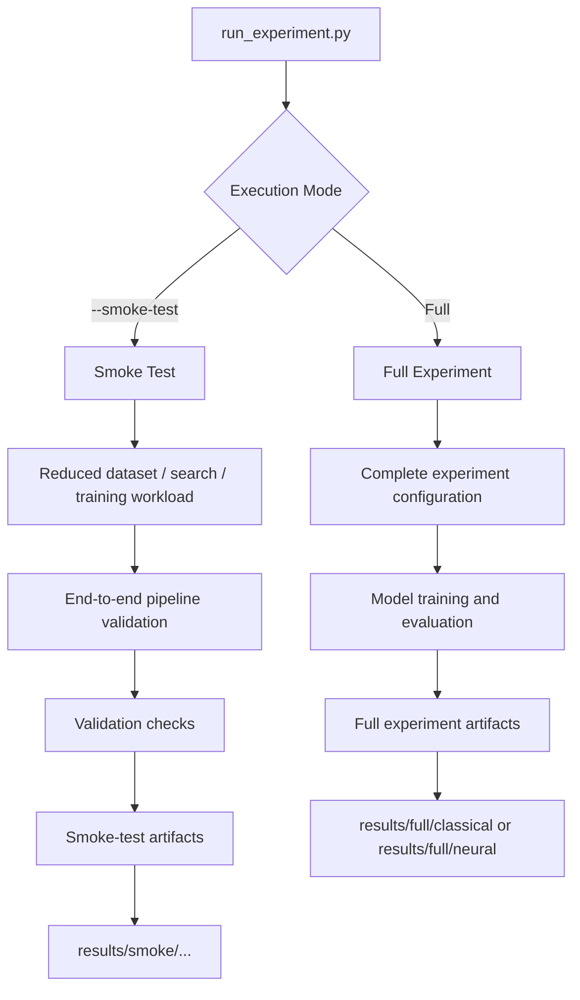
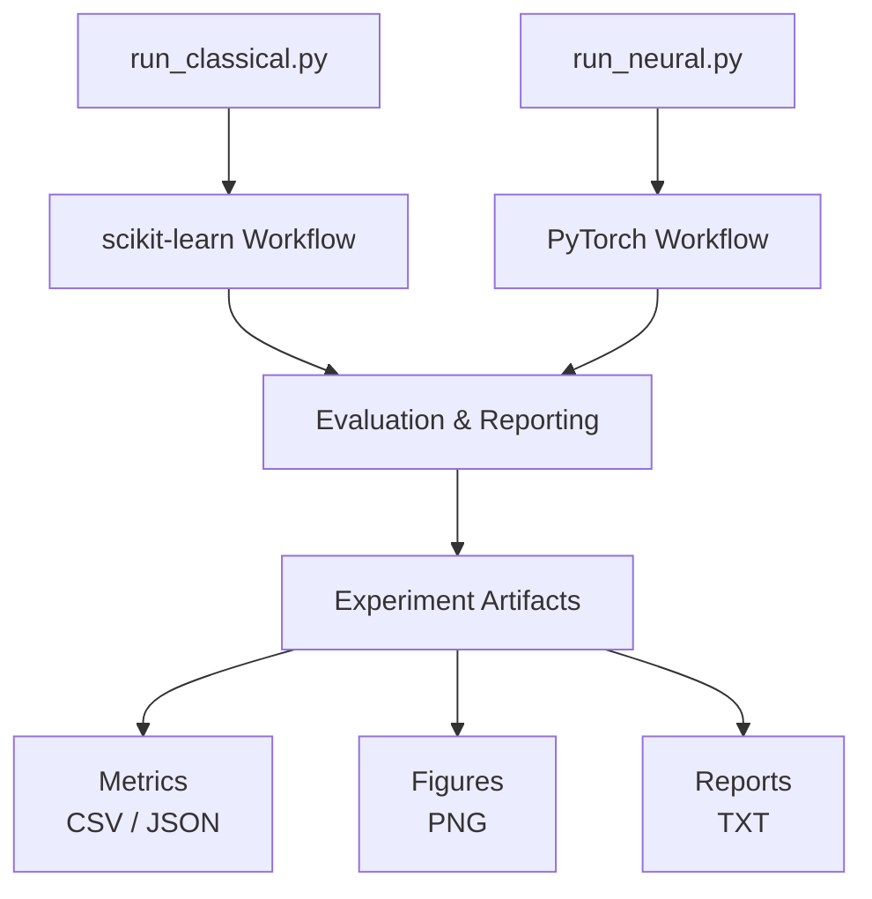
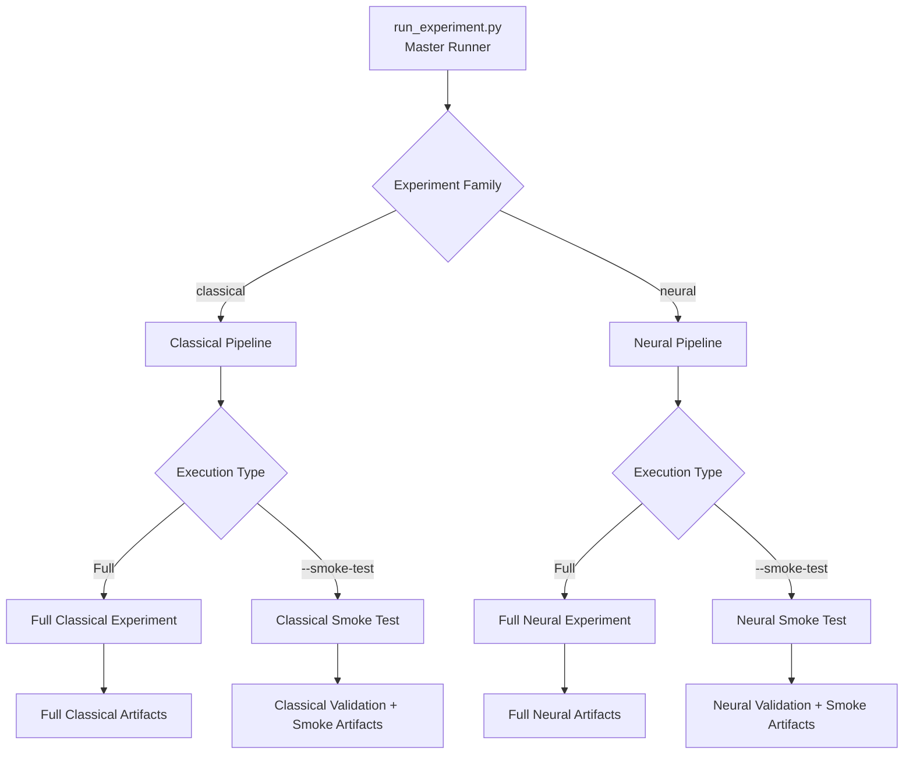
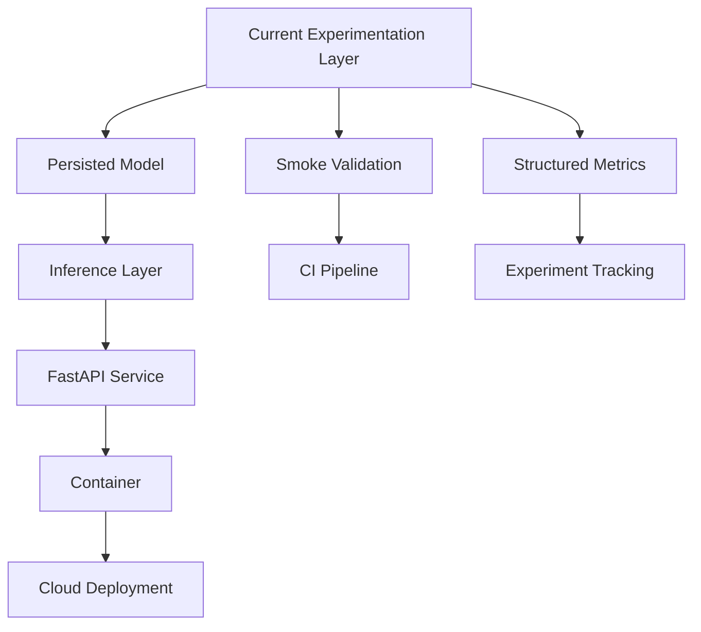

# Architecture

This document describes how the IMDb Sentiment Classification repository
is structured, why its responsibilities are separated the way they are,
and how the current experimentation layer can evolve without forcing
unrelated concerns into the same code.

For project purpose, quick start, headline results, and general usage,
return to the **[root README](../../README.md)**.

For environment setup and experiment commands, see the **[Quick
Start](../../README.md#quick-start)** in the root README.

For deeper ML interpretation, see **[Detailed Experiment
Analysis](../experiment_analysis.md)**.

------------------------------------------------------------------------

## Table of Contents

-   [Architecture Goals](#architecture-goals)
-   [End-to-End Architecture](#end-to-end-architecture)
-   [Design and Modularization](#design-and-modularization)
-   [Experiment Execution](#experiment-execution)
-   [Validation Architecture](#validation-architecture)
-   [Generated Artifacts](#generated-artifacts)
-   [Engineering Decisions and
    Learnings](#engineering-decisions-and-learnings)
-   [Extension Points](#extension-points)

------------------------------------------------------------------------

## Architecture Goals

Version 1 is organized around a few practical goals:

-   preserve the experimental learning in a clear, reproducible
    repository structure
-   move reusable execution logic into explicit modules
-   keep classical and neural workflows separate where their execution
    models genuinely differ
-   provide one common command-line entry point
-   validate expensive pipelines with reduced-cost smoke tests
-   persist experiment outputs in reusable formats
-   keep generated artifacts separate from source and permanent
    documentation
-   leave sensible extension points without prematurely building a full
    MLOps platform

The objective is not maximum abstraction. It is **clear responsibilities
and understandable execution flow**.

------------------------------------------------------------------------

## End-to-End Architecture

The repository supports two experiment paths---classical machine
learning and neural networks---built on the same IMDb dataset but using
different data representations and training workflows.

Both paths eventually converge on the same goal: evaluate the trained
models and preserve the results as reproducible experiment artifacts.

### Experiment Workflow

```{=html}
<p align="center">
```
``{=html}
```{=html}
</p>
```
The two branches intentionally remain separate during data preparation
and training.

The classical pipeline converts cleaned reviews into vectorized
representations and performs model selection through `GridSearchCV`. The
neural pipeline converts reviews into token sequences and feeds them
through PyTorch `Dataset` and `DataLoader` components before training
the neural architectures.

After training, both paths converge on evaluation and artifact
generation. Experiment results are preserved as metrics, figures, and
human-readable reports rather than existing only as terminal output.

This gives the project a common experiment structure while still
allowing the classical and neural implementations to use the data
representation and training workflow appropriate to each model family.

------------------------------------------------------------------------

### Execution and Orchestration

Experiment execution is kept separate from the underlying modeling
logic.



The three runner scripts have different responsibilities:

-   `run_classical.py` orchestrates the classical model experiments.
-   `run_neural.py` orchestrates the neural model experiments.
-   `run_experiment.py` provides a common command-line entry point and
    delegates execution to the appropriate runner.

The master runner therefore does not contain model-training logic. Its
responsibility is to select and launch the requested experiment path
while the implementation remains in the dedicated runners and source
modules.

This separation keeps command-line orchestration independent from model
implementation and leaves room for other entry points---such as
automated pipelines or an inference layer---to reuse the underlying
modules later.

------------------------------------------------------------------------

### Full Experiment vs Smoke-Test Execution

The same runner interface supports both full experiments and
reduced-cost smoke tests.



A full experiment is intended to produce the model results used for
comparison and analysis.

A smoke test answers a different question:

> **Can the complete pipeline execute successfully from data loading
> through artifact generation?**

The reduced workload makes it possible to verify the integration of the
pipeline before committing the time and compute required for a full
experiment.

Smoke-test artifacts are stored separately from full experiment
artifacts so that a validation run cannot overwrite final experiment
results.

## Design and Modularization

The modular version was developed by identifying experiment
responsibilities that could be separated and reused.

The intention was not to create many Python files simply for the sake of
having more modules. Each module has a specific role in the experiment
lifecycle.

### Separation of Responsibilities

  -----------------------------------------------------------------------
  Component                           Responsibility
  ----------------------------------- -----------------------------------
  `data.py`                           Load IMDb data and prepare the data
                                      structures required by the
                                      experiments

  `preprocessing.py`                  Clean review text and prepare
                                      vocabulary/token representations

  `classical_models.py`               Define classical scikit-learn
                                      pipelines and hyperparameter search
                                      spaces

  `neural_models.py`                  Define the PyTorch neural
                                      architectures

  `training.py`                       Execute reusable neural-network
                                      training logic

  `evaluation.py`                     Calculate evaluation metrics and
                                      generate evaluation figures

  `reporting.py`                      Persist experiment results as
                                      structured and human-readable
                                      artifacts

  `validation.py`                     Verify smoke-test execution and
                                      expected outputs

  `run_classical.py`                  Coordinate the complete classical
                                      experiment

  `run_neural.py`                     Coordinate the complete neural
                                      experiment

  `run_experiment.py`                 Provide the common command-line
                                      entry point
  -----------------------------------------------------------------------

This creates a simple distinction:

``` text
scripts/  →  decide what experiment to run and coordinate it

src/      →  implement the reusable experiment functionality

results/  →  preserve what the experiment produced

docs/     →  explain the project and its experimental findings
```

### Thin Orchestration, Reusable Implementation

The runner scripts are responsible for experiment flow rather than
implementing every operation themselves.

Conceptually:

``` text
Runner
  │
  ├── load data
  ├── prepare inputs
  ├── obtain model definitions
  ├── train models
  ├── evaluate results
  ├── validate the pipeline when requested
  └── generate artifacts
```

The actual implementation of those responsibilities remains in the
corresponding `src/` modules.

This makes it easier to change a model, evaluation routine, validation
check, or reporting format without moving unrelated logic into the
runners.

------------------------------------------------------------------------

### Classical and Neural Workflows Remain Independent

The two experiment families share the overall project structure but are
not forced into one artificial training abstraction.

The classical path uses scikit-learn pipelines and `GridSearchCV`, while
the neural path uses PyTorch datasets, DataLoaders, training loops, and
device-aware execution.

Keeping dedicated runners for the two paths makes those differences
explicit:



`run_experiment.py` sits above these runners and provides a common
interface without requiring the underlying workflows to be implemented
in the same way.

------------------------------------------------------------------------

### Reporting Is Kept Separate from Training

An experiment result can be useful in several forms.

A person may want a readable summary, while another program may need
structured data.

Reporting is therefore handled separately from model training.

``` text
Experiment Results
        │
   ┌────┼────┐
   │    │    │
   ▼    ▼    ▼
  CSV  JSON  TXT
   │    │     │
   │    │     └── Human-readable experiment report
   │    │
   │    └──────── Machine-readable structured results
   │
   └───────────── Tabular model comparison
```

Figures such as confusion matrices and training-loss curves are also
preserved as experiment artifacts.

This means results do not disappear when the terminal session ends and
can later be reused for documentation, comparison, automation, or
downstream tooling.

------------------------------------------------------------------------

### Validation Is Kept Separate from Experiment Logic

Full experiments can be expensive enough that discovering a pipeline
problem late in execution wastes significant time.

The project therefore provides reduced-cost smoke tests, but the
validation checks themselves are kept in `validation.py` rather than
being embedded throughout the runners.

The distinction is:

``` text
Experiment Runner
      │
      ▼
Execute reduced experiment
      │
      ▼
validation.py
      │
      ├── Was the dataset loaded?
      ├── Was preprocessing completed?
      ├── Did training complete?
      ├── Are the metrics valid?
      ├── Were expected figures generated?
      └── Were result artifacts created?
      │
      ▼
   PASS / FAIL
```

This gives the validation layer one clear responsibility: verify that
the expected end-to-end behavior occurred.

It also provides a useful foundation if these checks are later executed
automatically in CI.

------------------------------------------------------------------------

### Smoke and Full Results Are Isolated

Smoke testing deliberately uses reduced data, search spaces, and/or
training settings.

Its outputs therefore should not be mixed with final experiment results.

The project keeps the two artifact types separate:

``` text
results/
│
├── full/   
|   ├── classical/  ← full classical experiment
|   └── neural/     ← full neural experiment
│
└── smoke/
    ├── classical/   ← classical pipeline validation
    └── neural/      ← neural pipeline validation
```

This prevents a quick validation run from overwriting or being mistaken
for a full experiment result.

------------------------------------------------------------------------

### Why This Structure Matters

The modularization is intended to make the project easier to reason
about today while leaving sensible extension points for later versions.

For example, a future inference API should be able to reuse
preprocessing and model-related functionality without depending on the
experiment runner. Similarly, automated validation should be able to
invoke existing checks without duplicating them inside a CI script.

The objective is therefore not maximum abstraction. It is to keep
responsibilities clear enough that the project can evolve without
requiring the experiment code to be reorganized each time a new
capability is added.

## Experiment Execution

The repository provides three runner scripts, but `run_experiment.py` is
the recommended entry point for normal use.

``` text
scripts/
├── run_experiment.py    ← common command-line entry point
├── run_classical.py     ← classical experiment runner
└── run_neural.py        ← neural experiment runner
```

The dedicated runners contain the orchestration required by their
respective model families, while the master runner provides a consistent
interface for selecting which experiment to execute.

### Master Runner

The general command structure is:

``` bash
python scripts/run_experiment.py --mode <classical|neural> [--smoke-test]
```

This gives the repository four main execution paths:



The master runner does not implement the model-training algorithms
itself. It resolves the requested execution path and delegates the
experiment to the appropriate runner.

------------------------------------------------------------------------

### Run the Full Classical Experiment

``` bash
python scripts/run_experiment.py --mode classical
```

This executes the complete classical workflow:

``` text
IMDb data
   ↓
text preprocessing
   ↓
four classical model pipelines
   ↓
GridSearchCV
   ↓
held-out test evaluation
   ↓
model comparison
   ↓
experiment artifacts
```

The full experiment uses the complete labelled IMDb training and test
splits together with the configured hyperparameter search spaces.

Because cross-validation trains multiple configurations of each model,
runtime can vary considerably between classifiers.

------------------------------------------------------------------------

### Run the Full Neural Experiment

``` bash
python scripts/run_experiment.py --mode neural
```

This executes the complete neural workflow:

``` text
IMDb data
   ↓
tokenization + vocabulary
   ↓
PyTorch datasets / DataLoaders
   ↓
RNN / LSTM / BiLSTM + FastText / Self-Attention
   ↓
training
   ↓
held-out test evaluation
   ↓
loss + model comparison
   ↓
experiment artifacts
```

Neural training automatically selects the available execution device.

Conceptually:

``` python
device = torch.device("cuda" if torch.cuda.is_available() else "cpu")
```

When a compatible CUDA GPU is available, the neural models use it.
Otherwise, the same workflow falls back to CPU execution.

A GPU is not required for correctness, but it is strongly recommended
for the full neural experiment because CPU training can take
substantially longer.

------------------------------------------------------------------------

### Direct Runner Execution

The dedicated runners remain independently executable:

``` bash
python scripts/run_classical.py
```

``` bash
python scripts/run_neural.py
```

They also support their respective smoke-test execution paths.

The master runner is recommended for normal repository use because it
provides one consistent interface, while direct runner execution remains
useful during development or when working specifically on one experiment
family.

------------------------------------------------------------------------

## Validation Architecture

Full ML experiments can be expensive enough that discovering an
integration problem after a long training run is wasteful.

For that reason, the repository provides a reduced-cost **smoke-test
mode** for both experiment families.

The smoke test is designed to answer:

> **Can the complete experiment pipeline execute successfully from data
> loading through artifact generation?**

It is deliberately **not** designed to answer:

> **How well does this model perform?**

That distinction is important because smoke tests use reduced workloads
specifically to provide faster feedback.

------------------------------------------------------------------------

### Classical Smoke Test

Run:

``` bash
python scripts/run_experiment.py --mode classical --smoke-test
```

The classical smoke test reduces the cost of the full workflow by using:

-   `2,000` training reviews
-   `1,000` test reviews
-   `2` cross-validation folds
-   one hyperparameter configuration per model

The pipeline still exercises all four classical models:

-   Logistic Regression
-   Bernoulli Naive Bayes
-   LinearSVC
-   Random Forest

and continues through evaluation, artifact generation, and automated
validation.

The current smoke-test result is:

``` text
Result: 19/19 checks passed

SMOKE TEST: PASSED
```

The checks cover:

-   IMDb dataset loading
-   balanced smoke-test labels
-   text preprocessing
-   valid F1 scores
-   valid cross-validation F1 scores
-   confusion-matrix generation for all four models
-   inclusion of all four models in the final comparison
-   comparison CSV generation
-   comparison JSON generation
-   experiment report generation

------------------------------------------------------------------------

### Neural Smoke Test

Run:

``` bash
python scripts/run_experiment.py --mode neural --smoke-test
```

The neural smoke test uses:

-   `1,000` training reviews
-   `500` test reviews
-   `2` training epochs
-   temporary `300`-dimensional embeddings for the BiLSTM path

The temporary embedding matrix is intentional.

Downloading and preparing the full pretrained FastText vectors would add
substantial cost to a test whose purpose is simply to verify that the
BiLSTM embedding path, model training, evaluation, and artifact
generation work correctly.

The real FastText embeddings remain part of the **full neural
experiment**.

All four neural architectures are exercised:

-   RNN
-   LSTM
-   BiLSTM + FastText-compatible embedding path
-   Self-Attention

The current smoke-test result is:

``` text
Result: 35/35 checks passed

SMOKE TEST: PASSED
```

The checks cover:

-   IMDb dataset loading
-   balanced smoke-test labels
-   vocabulary creation
-   PyTorch DataLoader creation
-   completion of all four model-training paths
-   valid F1 scores
-   valid final training losses
-   individual training-loss figures
-   confusion matrices
-   BiLSTM embedding-matrix creation
-   inclusion of all four neural models in the final comparison
-   comparison CSV generation
-   comparison JSON generation
-   training-loss CSV generation
-   combined loss-comparison figure
-   experiment report generation

------------------------------------------------------------------------

### What a Passing Smoke Test Means

A passing smoke test provides evidence that the major components of the
experiment work together:

``` text
Data Loading
     ↓
Preprocessing
     ↓
Model Construction
     ↓
Training
     ↓
Evaluation
     ↓
Artifact Generation
     ↓
Validation
     ↓
PASS / FAIL
```

It does **not** certify that the model has reached useful predictive
performance.

For example, a neural model trained for only two epochs on a small
smoke-test subset may produce poor or highly skewed predictions while
the pipeline itself is functioning correctly.

The validation checks therefore focus primarily on:

-   successful execution
-   valid outputs
-   expected model coverage
-   expected artifact generation

rather than imposing benchmark-performance thresholds on smoke-test
models.

------------------------------------------------------------------------

### Smoke-Test Results Are Isolated

Validation runs write their artifacts to separate paths:

``` text
results/smoke/classical/
results/smoke/neural/
```

Full experiment outputs use their corresponding full-result locations.

This separation prevents a quick smoke test from overwriting or being
mistaken for the results of a complete experiment.

It also makes the purpose of an artifact clear when inspecting the
repository later.

## Generated Artifacts

Experiment outputs are persisted under `results/` rather than existing
only as terminal output.

The project generates three main categories of artifacts:

1.  **Figures** --- visual inspection of model behavior and training
2.  **Metrics** --- structured experiment results for comparison or
    downstream processing
3.  **Reports** --- human-readable summaries of experiment outcomes

### Artifact Structure

``` text
results/
│
├── full/
│   │
│   ├── classical/
│   │   ├── figures/
│   │   ├── metrics/
│   │   └── reports/
│   │
│   └── neural/
│       ├── figures/
│       ├── metrics/
│       └── reports/
│
└── smoke/
    ├── classical/
    │   ├── figures/
    │   ├── metrics/
    │   └── reports/
    │
    └── neural/
        ├── figures/
        ├── metrics/
        └── reports/
```

Full experiments and smoke tests intentionally use separate output
locations so that reduced validation runs cannot overwrite or be
mistaken for final experiment results.

------------------------------------------------------------------------

### Figures

Evaluation and training figures are saved automatically as PNG files.

#### Classical experiments

Each classical model produces a confusion matrix:

``` text
logistic_regression_confusion_matrix.png
bernoulli_naive_bayes_confusion_matrix.png
linearsvc_confusion_matrix.png
random_forest_confusion_matrix.png
```

These figures make it possible to inspect the balance between correctly
and incorrectly classified positive and negative reviews rather than
relying only on aggregate metrics.

#### Neural experiments

Each neural model produces:

-   a confusion matrix
-   an individual training-loss curve

The neural experiment also produces a combined loss-comparison figure:

``` text
neural_loss_comparison.png
```

This allows the training behavior of the neural architectures to be
compared alongside their final predictive metrics.

Figures are saved and closed programmatically, allowing the experiment
to continue without requiring the user to manually close plotting
windows.

------------------------------------------------------------------------

### Structured Metrics

Model-comparison results are exported in both **CSV** and **JSON**
formats.

For classical experiments, the comparison includes values such as:

-   Accuracy
-   Precision
-   Recall
-   F1 score
-   cross-validation F1
-   runtime

For neural experiments, the comparison additionally preserves
information such as:

-   trainable parameter count
-   final training loss
-   runtime

Neural training losses are also exported separately so that epoch-level
training behavior remains available outside the terminal session.

The two formats serve different purposes:

  -----------------------------------------------------------------------
  Format                              Primary Purpose
  ----------------------------------- -----------------------------------
  **CSV**                             Human inspection, tabular
                                      comparison, spreadsheet or
                                      data-analysis workflows

  **JSON**                            Machine-readable results for future
                                      scripts, APIs, automation, or
                                      experiment tooling
  -----------------------------------------------------------------------

Keeping structured results independent from the terminal output also
makes future automated comparison or MLOps integration easier without
changing the training logic.

------------------------------------------------------------------------

### Human-Readable Reports

Each experiment also produces a plain-text report containing a readable
summary of the experiment results.

``` text
reports/
└── <experiment>_experiment_report.txt
```

The report complements the structured CSV and JSON artifacts:

``` text
Experiment Output
        │
        ├── CSV   → tabular comparison
        ├── JSON  → machine consumption
        ├── TXT   → human-readable summary
        └── PNG   → visual analysis
```

This separation keeps result presentation independent from model
training while allowing the same experiment outcome to be consumed in
different ways.

------------------------------------------------------------------------

### Why Persist Experiment Outputs?

Experiment results can be inspected immediately after execution, but
terminal output alone is temporary.

In this repository, experiment outputs are therefore treated as reusable
artifacts.

Persisting them makes it possible to:

-   compare experiments without rerunning expensive training
-   inspect confusion matrices and loss curves later
-   reuse figures directly in project documentation
-   preserve machine-readable metrics for future tooling
-   retain human-readable experiment summaries
-   build future automation around consistent output formats

The goal is simple: **an experiment should leave behind enough evidence
to understand what ran and what it produced.**

## Engineering Decisions and Learnings

A significant part of this project was not building new models, but
deciding how an experimental workflow should be organized as a reusable
ML repository.

The repository combines experimentation, model comparison, evaluation,
reporting, and analysis with a repeatable software workflow.

Several design decisions shaped that structure.

### 1. Separate Exploration Concerns from Reusable Execution

An ML experiment combines several concerns:

``` text
data preparation
model definitions
training
evaluation
visualization
interpretation
```

These activities are closely related during exploration, but reusable
execution benefits from explicit responsibility boundaries.

The repository therefore places data handling, model definitions,
training, evaluation, validation, and reporting in dedicated modules and
runners. This keeps the experiment understandable while making the
complete workflow reproducible from the command line.

------------------------------------------------------------------------

### 2. Keep Classical and Neural Training Workflows Separate

The classical and neural experiments solve the same classification
problem, but their execution models are fundamentally different.

Classical models rely on:

-   sparse text features
-   scikit-learn pipelines
-   `GridSearchCV`
-   cross-validation-based model selection

Neural models rely on:

-   token sequences
-   vocabulary construction
-   PyTorch `Dataset` and `DataLoader`
-   epoch-based optimization
-   CPU/GPU device selection
-   training-loss tracking

Rather than forcing both approaches into a single generalized training
abstraction, the repository keeps dedicated classical and neural runners
while providing a common master entry point above them.

This keeps shared concerns shared without hiding meaningful differences
between the two model families.

------------------------------------------------------------------------

### 3. Treat Experiment Outputs as Artifacts

Experiment results can naturally appear only in terminal output during
development.

In the modular version, results are persisted deliberately.

``` text
Experiment
    │
    ├── Metrics  → CSV / JSON
    ├── Figures  → PNG
    └── Reports  → TXT
```

This makes results available after execution finishes and allows them to
be reused for:

-   comparison
-   documentation
-   automated processing
-   future experiment tracking
-   later MLOps workflows

The reporting concern is therefore kept separate from model training.

------------------------------------------------------------------------

### 4. Validate the Pipeline Before Paying the Full Compute Cost

A full experiment is not the ideal place to discover a missing import,
broken data path, failed figure export, or incompatible model interface.

This became especially relevant for the neural workflow, where full
training can be computationally expensive without GPU acceleration.

The smoke-test mode therefore executes the same overall pipeline with a
reduced workload.

The objective is not benchmark performance. It is integration
confidence.

``` text
Does data loading work?
Does preprocessing work?
Can every model be constructed?
Can training complete?
Can evaluation complete?
Are expected metrics valid?
Are expected artifacts generated?
```

Only after these questions pass does it make sense to spend
substantially more compute on a full experiment.

------------------------------------------------------------------------

### 5. Keep Validation Logic Separate from the Runners

Smoke testing introduces many checks, but embedding those checks
directly throughout `run_classical.py` and `run_neural.py` would make
the orchestration code increasingly difficult to read.

Validation therefore has its own responsibility in:

``` text
src/validation.py
```

The runners execute the experiment; the validation layer checks whether
the expected behavior occurred.

This keeps the runner focused on orchestration and creates a natural
extension point for future automated testing or CI workflows.

------------------------------------------------------------------------

### 6. Separate Human-Readable and Machine-Readable Reporting

A single result representation does not serve every consumer equally
well.

A developer may want JSON. A data analyst may prefer CSV. A person
reviewing an experiment may want a readable text summary.

The project therefore produces different representations from the same
experiment results rather than coupling reporting to one output format.

This also means future tooling can consume structured metrics without
having to parse terminal logs or human-readable reports.

------------------------------------------------------------------------

### 7. Keep Generated Outputs Out of Source Control

Experiment artifacts are generated outputs rather than source code.

The repository therefore ignores generated result content and Python
runtime artifacts such as:

``` text
__pycache__/
*.pyc
results/
```

The experiment creates the required result directories when needed.

This keeps Git focused on the code, configuration, and documentation
required to reproduce the experiment rather than accumulating
environment-specific or repeatedly generated files.

Selected figures intended specifically for permanent documentation can
instead be stored under:

``` text
docs/images/
```

This separates reproducible experiment output from intentionally
versioned documentation assets.

------------------------------------------------------------------------

### 8. Prefer Accurate Terminology over Inheriting Labels Unchanged

The source assignment referred to the attention architecture as
**Cross-Attention**.

In the implemented model, however, queries, keys, and values are derived
from the same sequence.

The modular repository therefore uses the more precise term:

> **Self-Attention**

This does not change the underlying experiment. It makes the repository
terminology reflect what the implementation actually does.

------------------------------------------------------------------------

### 9. Do Not Equate Model Complexity with Model Quality

One of the clearest lessons from the experiments is that increasing
architectural complexity does not guarantee better held-out performance.

The classical LinearSVC and Logistic Regression models remained
extremely competitive despite being much simpler than the neural
architectures.

Within the neural experiments, the BiLSTM + FastText model achieved the
lowest training loss while Self-Attention generalized considerably
better.

These results reinforce a broader engineering principle:

> **Model selection should be driven by evidence and operational
> requirements, not by architectural complexity alone.**

Predictive performance, generalization, runtime, model size, deployment
complexity, and maintainability all matter when deciding which model is
appropriate for a real system.

------------------------------------------------------------------------

### 10. Design v1 for Extension Without Building v2 Prematurely

The repository structure leaves sensible extension points for
capabilities such as:

-   persisted trained models
-   inference APIs
-   containerization
-   automated testing
-   CI/CD
-   experiment tracking
-   cloud deployment
-   model monitoring

Those capabilities are intentionally not implemented simply to make the
repository appear more production-like.

Version 1 focuses on making the experimentation layer clear,
reproducible, validated, and reusable first.

This keeps the project extensible without turning the current
implementation into an unnecessarily complex MLOps platform.

## Extension Points

The current boundaries leave natural places for later capabilities
without requiring the experimentation layer to be redesigned.



Potential extensions include model persistence, an inference API,
containerization, CI based on the existing validation layer, experiment
tracking, cloud deployment, and basic monitoring.

These are extension points rather than current v1 claims. The project
deliberately establishes the validated experimentation layer first.

For the current project scope and future-improvement list, return to the
**[root README](../../README.md)**.
