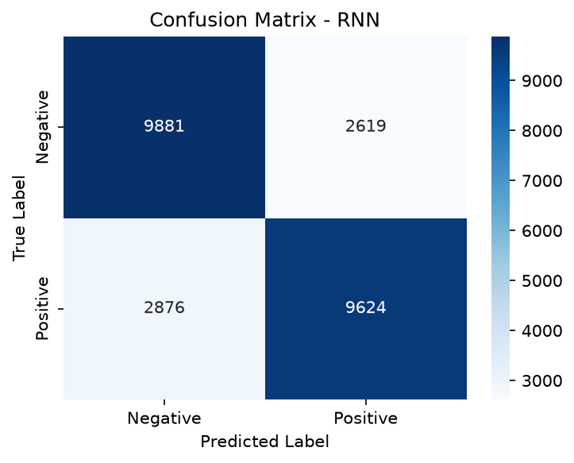
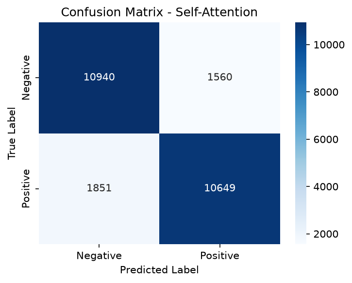
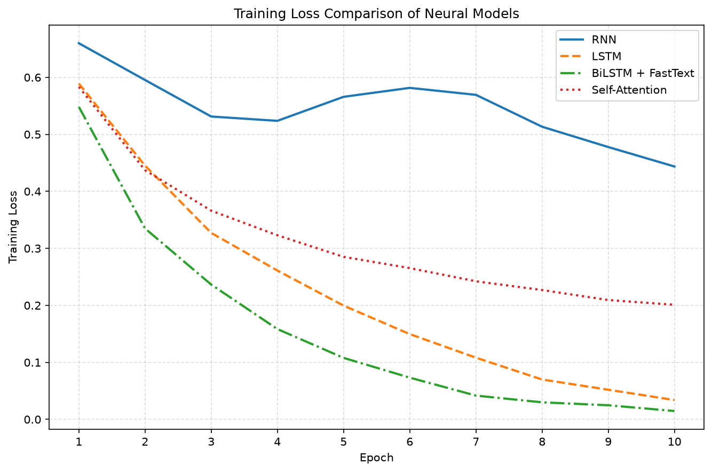

# Experiment Analysis

This document preserves the deeper machine-learning analysis behind the IMDb Sentiment Classification project.

The root [`README.md`](../README.md) is the project entry point: it explains the purpose, usage, headline results, and current scope. The [`docs/architecture/README.md`](architecture/README.md) explains how the modular codebase is structured.

This document focuses on a different question:

> **What did the experiments actually show, how should the results be interpreted, and what can — and cannot — be concluded from them?**

The analysis is based on the completed classical experiment and the completed neural-network notebook experiment that formed the basis of the modular implementation.

---

## Table of Contents

- [1. Experimental Objective](#1-experimental-objective)
- [2. Experimental Setup](#2-experimental-setup)
- [3. Interpreting the Evaluation Metrics](#3-interpreting-the-evaluation-metrics)
- [4. Classical Machine-Learning Analysis](#4-classical-machine-learning-analysis)
- [5. Neural-Network Analysis](#5-neural-network-analysis)
- [6. Training Loss and Generalization](#6-training-loss-and-generalization)
- [7. Classical vs Neural Models](#7-classical-vs-neural-models)
- [8. Error Analysis](#8-error-analysis)
- [9. Attention Analysis](#9-attention-analysis)
- [10. What the Experiments Demonstrate](#10-what-the-experiments-demonstrate)
- [11. What the Experiments Do Not Establish](#11-what-the-experiments-do-not-establish)
- [12. Useful Follow-Up Experiments](#12-useful-follow-up-experiments)
- [13. Key Learnings](#13-key-learnings)

---

## 1. Experimental Objective

The project compares several ways of approaching the same binary sentiment-classification problem.

The model families range from sparse linear classifiers to recurrent neural networks and self-attention:

| Family | Models |
|---|---|
| Classical ML | Logistic Regression, Bernoulli Naive Bayes, LinearSVC, Random Forest |
| Neural Networks | Vanilla RNN, LSTM, BiLSTM + FastText, Self-Attention |

The purpose of the comparison is broader than finding the largest F1 score.

The experiments examine:

- how strong classical text-classification baselines can be
- whether recurrent memory improves performance on long reviews
- what happens when bidirectionality and pretrained embeddings are introduced
- how self-attention compares with recurrent architectures
- whether lower training loss translates into better held-out performance
- how model complexity relates to predictive performance
- what kinds of reviews remain difficult to classify

This makes the project a comparison of **model behavior and trade-offs**, not simply a leaderboard.

---

## 2. Experimental Setup

### Dataset

The experiments use the Stanford IMDb Large Movie Review Dataset:

| Split | Reviews | Positive | Negative |
|---|---:|---:|---:|
| Training | 25,000 | 12,500 | 12,500 |
| Test | 25,000 | 12,500 | 12,500 |

The balanced class distribution is important when interpreting accuracy: a classifier near `0.50` accuracy is effectively close to chance performance on this task.

### Classical representation

The classical workflow cleans the review text and uses `CountVectorizer` inside a scikit-learn `Pipeline`.

Model selection uses `GridSearchCV`, optimized by F1 score. Keeping vectorization inside the pipeline ensures that the vectorizer is fitted independently within each cross-validation training fold.

The selected estimator is then evaluated on the held-out IMDb test split.

### Neural representation

The neural workflow:

1. tokenizes the reviews
2. builds a vocabulary from the training data
3. converts tokens to integer IDs
4. pads or truncates sequences to a maximum length of `400`
5. batches the sequences through PyTorch `Dataset` and `DataLoader`

The standard batch size is `64`.

The completed reference notebook trained the neural architectures for `10` epochs.

### A note on comparability

The classical and neural experiments use the same sentiment-classification task and underlying IMDb split, but they do **not** differ only in classifier architecture.

Classical models use sparse vectorized text. Neural models use learned token embeddings and sequence processing.

The comparison is therefore useful as a practical model-family comparison, but it should not be interpreted as a perfectly controlled experiment in which only one variable changes.

---

## 3. Interpreting the Evaluation Metrics

Four held-out metrics are used throughout the project.

### Accuracy

Accuracy measures the fraction of all reviews classified correctly.

For this balanced dataset it is easy to interpret, but it does not show whether errors are distributed differently between positive and negative reviews.

### Precision

For the positive class, precision asks:

> Of the reviews predicted as positive, how many were actually positive?

High precision means relatively few negative reviews were incorrectly labelled positive.

### Recall

Recall asks:

> Of the reviews that were actually positive, how many did the model identify?

High recall means relatively few positive reviews were missed.

### F1 score

F1 is the harmonic mean of precision and recall.

It is used as the primary comparison metric in this project because it rewards models that balance both quantities rather than optimizing one while sacrificing the other.

### Confusion matrix

The confusion matrix adds information that aggregate scores cannot show directly:

```text
                 Predicted
               Negative Positive
Actual Negative    TN      FP
Actual Positive    FN      TP
```

It is especially useful when inspecting whether a model has developed a strong preference for one class.

### Cross-validation F1

For classical models, `GridSearchCV` provides an additional model-selection signal before the final held-out test evaluation.

The important distinction is:

```text
Cross-validation F1 → model / hyperparameter selection
Test F1             → final held-out evaluation
```

The test set should not be treated as the search mechanism itself.

---

## 4. Classical Machine-Learning Analysis

### Overall results

| Model | Accuracy | Precision | Recall | F1 Score | CV F1 | Runtime |
|---|---:|---:|---:|---:|---:|---:|
| **LinearSVC** | **0.8746** | **0.8719** | 0.8782 | **0.8750** | 0.8615 | 3.60 min |
| **Logistic Regression** | 0.8734 | 0.8658 | **0.8839** | 0.8748 | **0.8663** | **1.46 min** |
| **Random Forest** | 0.8530 | 0.8463 | 0.8627 | 0.8544 | 0.8519 | 54.16 min |
| **Bernoulli Naive Bayes** | 0.8232 | 0.8683 | 0.7619 | 0.8117 | 0.7985 | 1.59 min |

Two models stand out immediately: LinearSVC and Logistic Regression.

Their held-out F1 scores differ by only `0.0002`. That difference is too small to support a strong claim that one is meaningfully better from this run alone. The more useful conclusion is that **both linear classifiers are extremely competitive on this sparse text representation**.

### Logistic Regression

Logistic Regression achieved:

```text
Accuracy : 0.8734
Precision: 0.8658
Recall   : 0.8839
F1       : 0.8748
CV F1    : 0.8663
Runtime  : 1.46 min
```

Its most notable result is the highest recall among the classical models.

It also achieved the highest cross-validation F1 and the shortest reported search runtime in the full classical comparison.

This makes Logistic Regression a particularly strong baseline: its predictive result is essentially tied with LinearSVC while remaining computationally efficient and providing probabilistic outputs if those are needed in a later application.

### LinearSVC

LinearSVC achieved:

```text
Accuracy : 0.8746
Precision: 0.8719
Recall   : 0.8782
F1       : 0.8750
CV F1    : 0.8615
Runtime  : 3.60 min
```

It produced the highest held-out F1 in the complete experiment.

The important point is not the tiny `0.0002` advantage over Logistic Regression. It is that a margin-based linear model operating on sparse text features remained competitive with — and in this experiment slightly exceeded — all of the more complex neural architectures.

For a practical model-selection decision based on these experiments alone, LinearSVC would therefore be a strong candidate.

### Bernoulli Naive Bayes

Bernoulli Naive Bayes achieved:

```text
Accuracy : 0.8232
Precision: 0.8683
Recall   : 0.7619
F1       : 0.8117
CV F1    : 0.7985
Runtime  : 1.59 min
```

Its precision remained relatively strong, but recall dropped substantially.

That means the model was comparatively conservative about predicting the positive class: when it predicted positive it was often correct, but it failed to recover a larger share of the actual positive reviews.

This precision-recall imbalance explains why its F1 score is clearly below the two strongest linear models.

### Random Forest

Random Forest achieved:

```text
Accuracy : 0.8530
Precision: 0.8463
Recall   : 0.8627
F1       : 0.8544
CV F1    : 0.8519
Runtime  : 54.16 min
```

Its F1 is respectable, but the runtime result is particularly important.

The reported hyperparameter-search runtime was approximately `54.16` minutes, compared with `1.46` minutes for Logistic Regression and `3.60` minutes for LinearSVC.

The additional computational cost did not produce a corresponding predictive improvement.

For this representation and task, that makes Random Forest a weaker engineering trade-off than the two linear alternatives.

### Cross-validation vs held-out performance

| Model | Best CV F1 | Test F1 |
|---|---:|---:|
| Logistic Regression | **0.8663** | 0.8748 |
| LinearSVC | 0.8615 | **0.8750** |
| Random Forest | 0.8519 | 0.8544 |
| Bernoulli Naive Bayes | 0.7985 | 0.8117 |

The held-out scores remain reasonably close to the cross-validation scores.

This is useful because the final comparison is not based solely on the test set. Model selection happened through cross-validation first, and the selected estimators were then evaluated against held-out data.

The small differences between CV and test performance are not evidence that the test set was used incorrectly; some variation between estimates is expected.

---

## 5. Neural Model Results

The finalized neural experiment trained and evaluated four architectures on the full Stanford IMDb dataset:

- Vanilla RNN
- LSTM
- BiLSTM with pretrained FastText embeddings
- Self-Attention

All four models were trained for 10 epochs and evaluated on the 25,000-review test split.

The final results were:

| Model | Accuracy | Precision | Recall | F1 Score | Trainable Parameters | Final Training Loss |
|---|---:|---:|---:|---:|---:|---:|
| **Self-Attention** | **0.8636** | 0.8722 | 0.8519 | **0.8620** | 3,802,753 | 0.2010 |
| **LSTM** | 0.8622 | **0.8735** | 0.8470 | 0.8601 | 4,649,601 | 0.0339 |
| **BiLSTM + FastText** | 0.8476 | 0.8375 | **0.8624** | 0.8498 | 11,588,229 | 0.0147 |
| **Vanilla RNN** | 0.7802 | 0.7861 | 0.7699 | 0.7779 | 3,958,401 | 0.4436 |

### Impact of the recurrent sequence-handling correction

The recurrent sequence-handling correction materially changed the results of the recurrent models, while Self-Attention remained essentially unchanged because it already masked padded positions during attention.

| Model | Earlier F1 | Finalized F1 | Change |
|---|---:|---:|---:|
| Vanilla RNN | 0.4874 | 0.7779 | **+0.2905** |
| LSTM | 0.7906 | 0.8601 | **+0.0695** |
| BiLSTM + FastText | 0.7813 | 0.8498 | **+0.0685** |
| Self-Attention | 0.8601 | 0.8620 | +0.0019 |

This before-and-after comparison is an important part of the experiment: the implementation was corrected, the full neural workflow was rerun, and the interpretation was revised based on the new evidence.

### Vanilla RNN: meaningful learning after sequence-handling correction

The finalized Vanilla RNN achieved:

```text
Accuracy : 0.7802
Precision: 0.7861
Recall   : 0.7699
F1       : 0.7779
```

<p align="center">
  
</p>

The confusion matrix shows that the corrected RNN now makes meaningful predictions for both classes rather than collapsing toward chance-level behavior.

Its training loss decreased from:

```text
Epoch 1  : 0.6599
Epoch 10 : 0.4436
```

The loss trajectory was less smooth than those of the other neural models, with temporary increases during the middle epochs, but the overall trend showed substantial learning.

This result is particularly important because an earlier implementation produced near-chance performance:

```text
Earlier RNN F1    : 0.4874
Finalized RNN F1  : 0.7779
Difference        : +0.2905
```

The earlier recurrent implementation processed fixed-length padded sequences without ensuring that the final recurrent representation corresponded to each review's last real token. Consequently, padded timesteps could influence the representation used for classification.

The finalized implementation tracks the true sequence lengths and uses packed recurrent processing, allowing the RNN to operate on the meaningful portion of each review rather than treating padded timesteps as part of the sequence.

The substantial improvement after this correction demonstrates an important experimental lesson:

> **Implementation details in sequence handling can materially affect model performance and can confound conclusions about the underlying architecture.**

The earlier near-chance result therefore should not be interpreted primarily as evidence that Vanilla RNNs are incapable of learning sentiment from long reviews. Under the corrected implementation, the RNN learned a meaningful classifier, although it still remained the weakest of the four neural architectures.

### LSTM: strong performance with gated recurrence

The finalized LSTM achieved:

```text
Accuracy : 0.8622
Precision: 0.8735
Recall   : 0.8470
F1       : 0.8601
```

Its training loss decreased consistently:

```text
Epoch 1  : 0.5891
Epoch 10 : 0.0339
```

Compared with the finalized Vanilla RNN:

```text
Vanilla RNN F1 : 0.7779
LSTM F1        : 0.8601
Difference     : +0.0822
```

The LSTM therefore substantially outperformed the Vanilla RNN while using the same corrected variable-length sequence handling.

This comparison provides cleaner evidence for the practical advantage of gated recurrence in this experiment. The LSTM's memory cell and gating mechanisms provide additional control over what information is retained, updated, and forgotten while processing a sequence.

At the same time, the corrected result shows why the earlier RNN-to-LSTM comparison had to be interpreted cautiously. The original observed F1 gap was approximately `0.3032`; after correcting recurrent sequence handling, the gap became `0.0822`.

The LSTM still performed clearly better, but the magnitude of the architectural difference was substantially smaller once the implementation confound was removed.

### BiLSTM + FastText: strongest training fit, but not strongest generalization

The BiLSTM experiment combined:

1. bidirectional recurrent processing
2. pretrained 300-dimensional FastText embeddings

FastText coverage for the finalized vocabulary was:

```text
Vocabulary size          : 29,123
Words with FastText vector: 26,296
Coverage                 : 90.3%
```

The finalized model achieved:

```text
Accuracy : 0.8476
Precision: 0.8375
Recall   : 0.8624
F1       : 0.8498
```

Its training loss decreased dramatically:

```text
Epoch 1  : 0.5482
Epoch 10 : 0.0147
```

This was the lowest final training loss among all four neural models.

However, the BiLSTM + FastText model did not achieve the strongest held-out performance. Its F1 of `0.8498` remained below both the LSTM (`0.8601`) and Self-Attention (`0.8620`).

The model also had the largest parameter count:

```text
11,588,229 trainable parameters
```

This provides a useful generalization lesson:

> **Greater model capacity, pretrained embeddings, and lower training loss do not automatically produce better held-out performance.**

The precision-recall pattern was also notable:

```text
Precision : 0.8375
Recall    : 0.8624
```

Among the finalized neural models, BiLSTM + FastText achieved the highest recall, indicating that it recovered a relatively large proportion of positive reviews, although with lower precision than the LSTM and Self-Attention models.

### Self-Attention: strongest neural result

The finalized Self-Attention model achieved the strongest overall neural result:

```text
Accuracy : 0.8636
Precision: 0.8722
Recall   : 0.8519
F1       : 0.8620
```

<p align="center">
  
</p>

The confusion matrix shows relatively balanced performance across positive and negative reviews, consistent with the model's strong precision, recall, and F1 scores.

Its training loss decreased steadily:

```text
Epoch 1  : 0.5834
Epoch 10 : 0.2010
```

The model achieved the highest neural F1 despite finishing with a substantially higher training loss than both the LSTM and BiLSTM + FastText models.

This again demonstrates that minimizing training loss as aggressively as possible is not equivalent to maximizing held-out performance.

The Self-Attention result was only slightly ahead of the finalized LSTM:

```text
Self-Attention F1 : 0.8620
LSTM F1           : 0.8601
Difference        : 0.0019
```

The two models should therefore be viewed as performing very similarly under this experimental configuration rather than as demonstrating a large performance advantage for Self-Attention.

The Self-Attention architecture also provides attention weights for later inspection, offering an additional diagnostic view of learned token relationships that is not available in the recurrent baselines. These weights are useful for inspecting attention patterns, but they should not be interpreted as complete explanations of the model's predictions.

### Neural Model Takeaway

The finalized experiment produces a more balanced picture than the earlier reference results.

The corrected ranking is:

```text
Self-Attention      F1 = 0.8620
LSTM                F1 = 0.8601
BiLSTM + FastText   F1 = 0.8498
Vanilla RNN         F1 = 0.7779
```

Three conclusions stand out:

1. **Correct sequence handling matters.** Fixing padded-sequence handling materially improved all recurrent-model comparisons, with the largest effect observed for the Vanilla RNN.

2. **Architectural complexity does not guarantee better generalization.** BiLSTM + FastText had the largest parameter count and lowest training loss but did not achieve the strongest test F1.

3. **LSTM and Self-Attention performed very similarly.** Self-Attention achieved the highest neural F1, but its advantage over LSTM was only `0.0019`.

The corrected experiment therefore provides a stronger basis for comparing the architectures because the recurrent models now operate on true sequence lengths rather than allowing padded timesteps to confound their final representations.

---

## 6. Training Loss and Generalization

The finalized neural experiment makes the distinction between **fitting the training data** and **generalizing to unseen data** particularly clear.

| Model | Final Training Loss | Test F1 |
|---|---:|---:|
| BiLSTM + FastText | **0.0147** | 0.8498 |
| LSTM | 0.0339 | 0.8601 |
| Self-Attention | 0.2010 | **0.8620** |
| Vanilla RNN | 0.4436 | 0.7779 |

### Neural Training-Loss Comparison

<p align="center">
  
</p>

The combined loss curves make the contrast between training fit and held-out performance especially visible. BiLSTM + FastText and LSTM drove training loss far below Self-Attention, yet Self-Attention achieved the numerically highest neural test F1. The RNN curve also shows a less stable optimization path, including temporary loss increases in the middle epochs, before ending substantially below its initial loss.

If final training loss alone were used to select a model, BiLSTM + FastText would appear to be the strongest model by a substantial margin.

The held-out test results tell a different story.

BiLSTM + FastText reached the lowest final training loss (`0.0147`) but achieved a test F1 of `0.8498`. In contrast, Self-Attention finished with a much higher training loss (`0.2010`) while achieving the strongest neural test F1 (`0.8620`).

The LSTM showed the same general pattern:

```text
LSTM
Final training loss : 0.0339
Test F1             : 0.8601

Self-Attention
Final training loss : 0.2010
Test F1             : 0.8620
```

Despite the LSTM fitting the training objective much more strongly, its held-out performance was essentially comparable to Self-Attention.

This illustrates an important machine-learning principle:

```text
Training loss
     ↓
How strongly did the model fit the training objective?

Held-out metrics
     ↓
How well did the learned behavior transfer to unseen reviews?
```

### Evidence of a Generalization Gap

The BiLSTM + FastText model provides the clearest example.

Its training loss decreased from:

```text
Epoch 1  : 0.5482
Epoch 10 : 0.0147
```

Yet its test F1 (`0.8498`) remained below both:

```text
LSTM F1           : 0.8601
Self-Attention F1 : 0.8620
```

The model also had the largest capacity of the neural architectures:

```text
BiLSTM + FastText : 11,588,229 trainable parameters
```

The combination of very low final training loss, high model capacity, and comparatively weaker held-out performance is consistent with a **generalization gap**.

However, the experiment did not maintain a dedicated validation-loss curve or perform validation-based early stopping. Therefore, the exact onset or magnitude of overfitting cannot be established precisely from the available evidence.

It is more defensible to conclude that the BiLSTM + FastText model fit the training objective much more strongly than was reflected in its held-out performance.

### Why Test Metrics Matter

The finalized results demonstrate why model selection should not be based on training loss alone.

A model can continue improving its fit to the training data without producing a corresponding improvement on unseen examples.

For this experiment, the relevant comparison is therefore not:

```text
Which model achieved the lowest training loss?
```

but rather:

```text
Which model produced the strongest held-out classification performance?
```

Under that criterion, Self-Attention achieved the strongest neural F1 (`0.8620`), with LSTM (`0.8601`) performing almost identically.

### Main Takeaway

The finalized neural experiment supports the following conclusion:

> **A substantially lower training loss did not necessarily correspond to better held-out performance.**

BiLSTM + FastText and LSTM both achieved much lower final training losses than Self-Attention, yet Self-Attention produced the highest neural test F1.

This reinforces the importance of evaluating model behavior using held-out metrics rather than interpreting training loss as a direct measure of generalization.
---

## 7. Classical vs Neural Models

With the finalized classical and neural experiments, all eight models can now be compared using the same held-out IMDb test split.

| Model | Family | Accuracy | Precision | Recall | F1 Score |
|---|---|---:|---:|---:|---:|
| **LinearSVC** | Classical | **0.8750** | 0.8726 | 0.8783 | **0.8750** |
| Logistic Regression | Classical | 0.8748 | 0.8708 | **0.8802** | 0.8748 |
| Self-Attention | Neural | 0.8636 | 0.8722 | 0.8519 | 0.8620 |
| LSTM | Neural | 0.8622 | **0.8735** | 0.8470 | 0.8601 |
| Random Forest | Classical | 0.8544 | 0.8521 | 0.8575 | 0.8544 |
| BiLSTM + FastText | Neural | 0.8476 | 0.8375 | 0.8624 | 0.8498 |
| Bernoulli Naive Bayes | Classical | 0.8117 | 0.8082 | 0.8177 | 0.8117 |
| Vanilla RNN | Neural | 0.7802 | 0.7861 | 0.7699 | 0.7779 |

### Classical Baselines Remained Highly Competitive

The strongest overall result came from LinearSVC:

```text
LinearSVC F1           : 0.8750
Logistic Regression F1 : 0.8748
```

The difference between the two models was only:

```text
0.0002 F1
```

This demonstrates how effective sparse TF-IDF representations combined with linear classifiers can be for IMDb sentiment classification.

Sentiment is often expressed through highly discriminative words and short phrases, making sparse lexical representations particularly effective for this task.

### Neural Complexity Did Not Automatically Produce Better Performance

The strongest neural result came from Self-Attention:

```text
Self-Attention F1 : 0.8620
```

followed very closely by:

```text
LSTM F1 : 0.8601
```

Neither exceeded the strongest linear classical baselines.

The gap between the best classical and neural models was:

```text
LinearSVC F1      : 0.8750
Self-Attention F1 : 0.8620
Difference        : 0.0130
```

This is relatively small, but it reinforces an important engineering lesson:

> **Greater architectural complexity does not automatically translate into better held-out performance.**

The appropriate model depends on the task, representation, computational requirements, deployment constraints, and the magnitude of any measurable performance benefit.

### Self-Attention and LSTM Were Essentially Comparable

The two strongest neural models produced very similar results:

```text
Self-Attention F1 : 0.8620
LSTM F1           : 0.8601
Difference        : 0.0019
```

The experiment therefore does not support a claim that Self-Attention was substantially better than LSTM.

Instead, both architectures learned strong sentiment classifiers under the finalized configuration, with Self-Attention achieving a small numerical advantage.

### BiLSTM + FastText Did Not Benefit Enough From Its Additional Complexity

BiLSTM + FastText had the largest neural parameter count:

```text
11,588,229 trainable parameters
```

and achieved the lowest final training loss:

```text
0.0147
```

However, its held-out F1 was:

```text
0.8498
```

which remained below both Self-Attention and LSTM.

The pretrained FastText embeddings achieved `90.3%` vocabulary coverage, and bidirectional recurrence provided additional representational capacity, but these advantages did not translate into the strongest held-out performance.

This is another example of why model capacity and training fit should not be treated as substitutes for test-set evaluation.

### The Corrected RNN Result Changes the Architectural Comparison

The finalized Vanilla RNN achieved:

```text
F1 : 0.7779
```

This remains the weakest neural result, but it is substantially stronger than the earlier near-chance result of `0.4874`.

The improvement followed the correction of recurrent sequence handling so that true sequence lengths and packed recurrent processing were used instead of allowing padded timesteps to influence the final recurrent representation.

This materially changes the interpretation of the experiment.

The finalized results still show a clear advantage for LSTM over Vanilla RNN:

```text
Vanilla RNN F1 : 0.7779
LSTM F1        : 0.8601
Difference     : 0.0822
```

However, this is much smaller than the earlier observed difference and provides a cleaner comparison between basic and gated recurrence.

### Practical Model Choice

For a production-oriented implementation of this particular experiment, LinearSVC would remain a strong candidate because it combines:

- the highest observed held-out F1
- relatively low model complexity
- efficient training and inference
- no GPU requirement for inference
- straightforward deployment and operational maintenance

Logistic Regression would also be an excellent candidate because its performance was effectively tied with LinearSVC while providing probabilistic outputs through `predict_proba`.

The neural experiments remain valuable for a different reason: they demonstrate and compare recurrent processing, gated memory, bidirectional context, pretrained embeddings, self-attention, sequence-length handling, and model generalization.

The strongest engineering choice and the most educational architecture are therefore not necessarily the same model.

### Main Takeaway

The finalized eight-model comparison demonstrates that:

1. **Strong classical baselines matter.** LinearSVC and Logistic Regression remained the strongest overall models.
2. **Neural models were competitive but not automatically superior.** Self-Attention and LSTM came close to the best classical results.
3. **Additional complexity did not guarantee better generalization.** BiLSTM + FastText was the largest neural model and achieved the lowest training loss without achieving the highest test F1.
4. **Implementation correctness materially affects architectural conclusions.** Correcting recurrent sequence handling changed the Vanilla RNN result from near-chance performance to a meaningful F1 of `0.7779`.

The experiment therefore supports model selection based on measured held-out performance, computational cost, operational requirements, and implementation correctness rather than architectural complexity alone.

---

## 8. Error Analysis

Aggregate metrics show how often the model is correct. Error analysis helps explain **why** it is wrong.

The strongest overall model, LinearSVC, was inspected through false-positive and false-negative examples.

### Mixed sentiment

Several errors involved reviews that contain both positive and negative language.

Some negative reviews contained locally positive expressions such as:

```text
"worth the entertainment value"
"entertaining"
"decent film"
```

while the overall review remained critical.

A sparse text classifier can learn that these terms correlate with positive sentiment without fully representing how the surrounding review changes their meaning.

The reverse problem also occurs: a positive review may discuss dark, unpleasant, violent, or otherwise negative subject matter while the reviewer is actually praising the film.

### False positives

A false positive occurs when:

```text
Actual sentiment    : Negative
Predicted sentiment : Positive
```

Mixed reviews are a natural source of this error. Positive local vocabulary can dominate the feature representation even when the writer's final judgement is negative.

### False negatives

A false negative occurs when:

```text
Actual sentiment    : Positive
Predicted sentiment : Negative
```

This can happen when the review contains many negative-sounding words because of the film's subject matter, criticism of particular elements, or a contrastive writing style, even though the overall judgement is favorable.

### What the errors reveal

The errors highlight a limitation shared in different ways by several models:

> **Detecting sentiment-bearing words is not the same as understanding the sentiment of the complete review.**

Long reviews can contain:

- contrast
- qualification
- mixed praise and criticism
- narrative description
- sarcasm
- sentiment shifts
- negative subject matter described positively

The model must eventually compress all of that into one binary decision.

---

## 9. Attention Analysis

The Self-Attention experiment also inspected attention weights for selected reviews.

The implemented model prepends a learnable classification token (`CLS`) and uses the resulting `CLS` representation for sentiment prediction. The attention weights provide a useful way to inspect which token relationships received relatively greater emphasis inside the attention mechanism.

### Correct Classifications

In some correctly classified examples, higher attention weights appeared around evaluative or sentiment-bearing expressions.

This was especially visible when strongly positive or negative words were consistent with the overall sentiment of the review.

These patterns are useful as diagnostic evidence because they show that semantically relevant parts of the review can receive stronger attention during processing.

### Misclassifications

Misclassified examples also revealed an important limitation.

Some reviews contained locally positive or negative expressions that did not represent the overall sentiment of the complete review.

In such cases, relatively strong attention could appear around these local sentiment-bearing expressions even though the broader review expressed a different conclusion.

This mirrors the mixed-sentiment problem observed during the classical-model error analysis.

Reviews containing contrast, mixed praise and criticism, sarcasm, or sentiment shifts can therefore remain difficult even when the model identifies locally meaningful relationships.

### Attention Is Evidence, Not a Complete Explanation

A high attention weight tells us that a token relationship received greater emphasis within the model's attention computation.

It does not by itself prove:

```text
"This word caused the prediction."
```

or:

```text
"The model understands this word exactly as a person would."
```

The final prediction emerges from the complete learned representation rather than from the attention weights alone.

In this implementation, the prediction is produced through:

```text
Token Embeddings
       +
Positional Information
        ↓
Multi-Head Self-Attention
        ↓
Attention-Transformed Representations
        ↓
CLS Representation
        ↓
Normalization
        ↓
Classification Layers
        ↓
Sentiment Prediction
```

The learned token embeddings, positional information, attention-transformed representations, aggregated `CLS` representation, and downstream classification layers all contribute to the final output.

Attention visualization is therefore best treated as a **diagnostic and interpretability aid**. It can help identify patterns worth investigating and generate hypotheses about model behavior, but it should not be treated as a complete causal explanation of why a particular prediction was made.

### Main Takeaway

The attention analysis provides two useful lessons:

1. Self-Attention can model relationships between different positions in a review without relying on recurrent information flow.
2. Attention weights can help inspect model behavior, but they must be interpreted together with the complete learned representation and the overall review context.

---

## 10. What the Experiments Demonstrate

The completed experiments support several useful conclusions.

### Strong classical baselines matter

LinearSVC and Logistic Regression achieved the two strongest held-out F1 scores:

```text
LinearSVC F1           : 0.8750
Logistic Regression F1 : 0.8748
```

A neural architecture should therefore be compared against strong classical baselines rather than assumed to be superior because it is newer or more complex.

### Correct sequence handling materially affects recurrent-model results

One of the most important findings emerged from correcting the recurrent sequence-handling implementation.

The earlier Vanilla RNN result was:

```text
Earlier RNN F1   : 0.4874
```

After using true sequence lengths and packed recurrent processing, the finalized result became:

```text
Finalized RNN F1 : 0.7779
```

This substantial change demonstrates that implementation details can materially affect experimental results and can lead to misleading architectural conclusions if they are not controlled correctly.

### LSTM gating still provided a clear advantage

With the corrected sequence handling applied consistently, the finalized comparison was:

```text
Vanilla RNN F1 : 0.7779
LSTM F1        : 0.8601
Difference     : +0.0822
```

The LSTM therefore still substantially outperformed the Vanilla RNN.

This provides cleaner evidence that gated recurrence was beneficial under the implemented configuration, while also showing that the earlier performance gap had been exaggerated by the sequence-handling issue.

### Training fit and generalization are different

BiLSTM + FastText achieved the lowest final training loss:

```text
0.0147
```

but did not produce the strongest held-out neural result.

Its F1 was:

```text
0.8498
```

compared with:

```text
LSTM F1           : 0.8601
Self-Attention F1 : 0.8620
```

The experiment therefore provides a concrete example of why training loss cannot be used as the sole model-selection criterion.

### More parameters did not guarantee better performance

BiLSTM + FastText had the largest trainable parameter count:

```text
11,588,229
```

yet its held-out F1 remained below both LSTM and Self-Attention.

Greater model capacity and pretrained embeddings did not automatically translate into stronger generalization.

### Self-Attention was the strongest neural architecture

Self-Attention achieved the strongest finalized neural result:

```text
Accuracy : 0.8636
F1       : 0.8620
```

However, LSTM was extremely close:

```text
LSTM F1           : 0.8601
Self-Attention F1 : 0.8620
Difference        : 0.0019
```

The results therefore support describing Self-Attention as the strongest neural model in this experiment, but not as substantially superior to LSTM.

### Model choice is an engineering decision

A final model should not be selected by F1 alone.

Relevant considerations include:

- held-out predictive quality
- stability across runs
- training cost
- inference cost
- model size
- hardware requirements
- interpretability needs
- operational complexity
- maintainability

For the evidence available in this project, LinearSVC offers a particularly strong balance of predictive performance, simplicity, and operational efficiency.

---

## 11. What the Experiments Do Not Establish

A useful experiment analysis should also state what cannot be concluded.

### The neural architectures were not exhaustively tuned

The neural experiments were designed to compare modeling approaches, not to find the maximum achievable score for every architecture.

Therefore, the results should not be interpreted as:

> "LSTM can only achieve 0.8601 F1 on IMDb."

They show what the implemented LSTM configuration achieved in this experiment.

### BiLSTM and FastText effects cannot be separated

Bidirectionality and pretrained embeddings were introduced together.

The result therefore cannot tell us whether the observed behavior came primarily from:

- bidirectionality
- FastText
- the combination
- the larger parameter count
- interactions with the training configuration

A controlled ablation would be needed to separate these effects.

### The neural test set is not a validation set

The neural workflow does not include a dedicated validation split for decisions such as epoch selection, learning-rate tuning, regularization, or early stopping.

A more rigorous model-development workflow would reserve validation data for those decisions and use the test set only for final evaluation.

### The completed runs do not measure neural variance across random seeds

The finalized neural experiment was executed twice on a Tesla T4 using the same implementation and configuration, and both executions reproduced the same evaluation metrics and epoch-level training losses.

This provides useful evidence of reproducibility under the tested environment and configuration.

However, the runs did not constitute a controlled multi-seed experiment. Neural-model performance can vary with initialization, data ordering, hardware behavior, and other stochastic factors.

Repeated experiments across multiple random seeds would therefore be needed to estimate mean performance, variance, and the statistical stability of the small differences between models.

This is particularly relevant to the small observed difference between:

```text
Self-Attention F1 : 0.8620
LSTM F1           : 0.8601
Difference        : 0.0019
```

The current experiment does not establish that this small difference represents a statistically reliable advantage for Self-Attention.

### Attention weights are not causal explanations

The attention visualization provides useful diagnostic information about which token relationships received stronger attention within the model.

However, attention weights alone do not establish why a particular prediction was made and should not be interpreted as a complete causal explanation of model behavior.

### The comparison does not prove a universal ranking

The results are specific to:

- this dataset
- these representations
- these model implementations
- these hyperparameters
- these training procedures

They do not imply that LinearSVC universally outperforms neural sentiment models or that Self-Attention universally outperforms LSTM.

---

## 12. Useful Follow-Up Experiments

The existing results suggest several controlled experiments that would deepen the analysis without changing the purpose of v1.

### Separate bidirectionality from FastText

A useful ablation matrix would be:

| Recurrent Direction | Embeddings |
|---|---|
| LSTM | learned/random |
| BiLSTM | learned/random |
| LSTM | FastText |
| BiLSTM | FastText |

This would allow the effect of bidirectionality and pretrained embeddings to be measured independently.

### Add validation-based early stopping

Track training and validation loss together and stop when validation performance no longer improves.

This would be especially useful for investigating the generalization behavior of BiLSTM + FastText and LSTM, both of which reached very low training losses without outperforming Self-Attention on the held-out test set.

### Tune neural regularization

Potential variables include:

- dropout
- weight decay
- learning rate
- learning-rate schedule
- hidden dimension
- number of layers

### Compare sequence lengths

The current maximum sequence length is `400`.

Testing shorter and longer limits could reveal the trade-off between:

- retained context
- compute cost
- recurrent difficulty
- truncation loss

### Repeat neural runs across random seeds

The finalized neural experiment was reproduced twice under the same configuration, producing identical evaluation metrics and epoch-level training losses.

A stronger follow-up experiment would vary the random seed systematically and report results such as:

```text
mean F1 ± standard deviation
```

This would quantify performance variance and help determine whether small observed differences, such as the `0.0019` F1 gap between Self-Attention and LSTM, are statistically meaningful.

### Add stronger representation baselines

A later experiment could compare `CountVectorizer` with alternatives such as TF-IDF while keeping the classifier fixed.

That would isolate the effect of representation from classifier choice.

These are follow-up experiments, not missing requirements for the current repository.

---

## 13. Key Learnings

The most useful outcome of the project is not one winning score. It is the set of modeling and engineering lessons exposed by the comparison.

1. **Always establish strong simple baselines.**  
   LinearSVC and Logistic Regression remained stronger than all neural models in the finalized comparison.

2. **Accuracy alone is not enough.**  
   Precision, recall, F1, confusion matrices, and class-specific error behavior reveal different aspects of a classifier.

3. **Cross-validation and held-out testing serve different purposes.**  
   Model selection should happen before final test evaluation.

4. **Implementation correctness can change the scientific conclusion.**  
   Correcting recurrent sequence handling changed Vanilla RNN F1 from `0.4874` to `0.7779` and materially improved the LSTM and BiLSTM results as well.

5. **Gating still improved recurrent learning after the implementation confound was removed.**  
   Under the finalized implementation, LSTM achieved `0.8601` F1 compared with `0.7779` for the Vanilla RNN.

6. **Lower training loss is not the same as better generalization.**  
   BiLSTM + FastText achieved the lowest final training loss (`0.0147`) without achieving the strongest held-out F1.

7. **More parameters do not guarantee better results.**  
   The largest neural model was not the strongest held-out classifier.

8. **Self-Attention and LSTM performed very similarly.**  
   Self-Attention was numerically strongest at `0.8620` F1, but the difference from LSTM (`0.8601`) was only `0.0019` and was not tested across multiple random seeds.

9. **Interpretability tools should be used carefully.**  
   Attention weights can help inspect model behavior but are not complete causal explanations.

10. **Model selection is ultimately an engineering trade-off.**  
    Predictive performance has to be considered together with compute, inference requirements, complexity, reproducibility, and maintainability.

---

## Final Perspective

The experiment started as a comparison of sentiment-classification models, but the most valuable result is broader.

It demonstrates why machine-learning evaluation should move beyond the question:

> **Which model is the most sophisticated?**

toward:

> **Which model learned useful behavior, generalized to unseen data, and provides an appropriate trade-off for the problem we are actually solving?**

For this experiment, the answer is nuanced:

- **LinearSVC** produced the strongest observed held-out F1 (`0.8750`).
- **Logistic Regression** was essentially tied (`0.8748`) while remaining very efficient.
- **Self-Attention** produced the numerically strongest neural F1 (`0.8620`), with **LSTM** almost identical at `0.8601`.
- **LSTM** demonstrated a clear advantage over the corrected Vanilla RNN while showing that the earlier RNN-to-LSTM gap had been exaggerated by improper sequence handling.
- **BiLSTM + FastText** demonstrated that extremely low training loss and greater model capacity can coexist with weaker held-out generalization.
- **Vanilla RNN** became one of the most valuable debugging lessons in the project: correcting padded-sequence handling changed its F1 from `0.4874` to `0.7779`, showing how an implementation detail can materially distort architectural conclusions.

The finalized neural experiment was also reproduced twice under the same configuration on a Tesla T4, producing identical evaluation metrics and epoch-level losses. This does not replace a formal multi-seed variance study, but it provides useful evidence that the finalized workflow is reproducible under the tested environment.

Together, these outcomes provide a more useful learning record than a single winning metric. The project documents not only model results, but also the process of identifying an experimental confound, correcting the implementation, rerunning the workflow, and revising the interpretation based on evidence.

---

**Related documentation**

- [Project README](../README.md)
- [Architecture Documentation](architecture/README.md)
